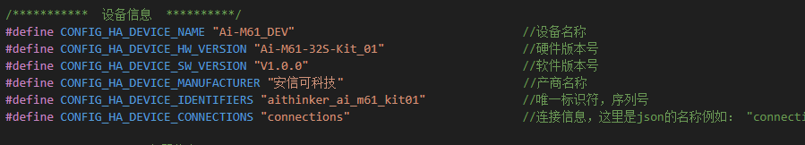
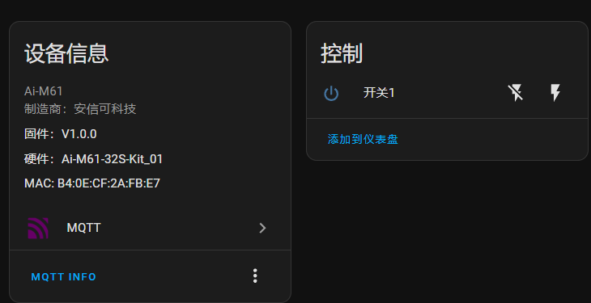

<div style="text-align: center;">

# HomeAssistant_MQTT-C  

</div>


## 简介

HomeAssistant_MQTT-C 这是一个主要为安信可 WiFi 模组开发的HomeAssistant 连接库，使用安信可模组时，只需要简单的修改就能接入HomeAssistant。目前已对Ai-M6x系列模组，Ai-WB2系列模组做了简单的适配，对应的SDK如下：

- **Ai-WB2 SDK:**[https://gitee.com/Ai-Thinker-Open/Ai-Thinker-WB2](https://gitee.com/Ai-Thinker-Open/Ai-Thinker-WB2)
- **Ai-M6x SDK:**[https://gitee.com/Ai-Thinker-Open/AiPi-Open-Kits](https://gitee.com/Ai-Thinker-Open/AiPi-Open-Kits)

**master 分支已开发完成的实体：**<span id="ok_entity_type"></span>
|实体类型|实体名称|状态|
| :-: | :-: |  :-:  |
|Switch|开关|:white_check_mark:|
|Sensor|传感器|:white_check_mark:|
|Binary sensor|二进制传感器|:white_check_mark: |
|Light|灯|:white_check_mark:|
|Text|文本|:white_check_mark:|
|Number|数字|:white_check_mark:|
|ClimateHVAC|空调/温控器|:white_check_mark:|
|Select|选择器/下拉选择框|:white_check_mark:|
|Button|按钮|:white_check_mark:|
|Device Trigger|触发器|:white_check_mark:|
|Scene|场景激活实体|:white_check_mark:|
## 基本使用方法

### 源码获取
推荐使用git进行克隆下载；当然如果不会git的，也可以使用ZIP压缩下载：
```shell
git clone https://gitee.com/Ai-Thinker-Open/Ai-M6x_HomeAssistant-C.git
```
### 移植方法

- Ai-WB2 SDK 移植方法请参考：[README_Ai-WB2.md](docs/README_Ai-WB2.md)
- Ai-M6x SDK 移植方法请参考：[README_Ai-M6x.md](docs/README_Ai-M6x.md)

### 修改接口
把[HomeAssistant_MQTT-C](./HomeAssistant-C/)库源码复制到你的工程当中。
>*我推荐使用已经可以连接WiFi功能的工程，比如（wifi/station），并且能够获取到IP地址*

开启 `homeAssistantPort.h` 当中相对应模组的宏定义，以启用它的MQTT接口，例如开启Ai-M62，而Ai-WB2 关闭：
```c
#define CONFIG_Ai_M6x
// #define CONFIG_Ai_WB2
```
***注意:如果开启的接口和目前正在使用的模组SDK不对应，会导致编译错误*** 


### 初始化HomeAssistant

首先需要在使用HomeAssistant 的 C 文件中应用库的头文件：
```
#include "homeAssistantPort.h"
```
在你工程代码初始化的地方初始化HomeAssistant，使用 **homeAssistant_device_init** 函数对HomeAssistant库进行初始化：
```c
/**
 * @brief HomeAssistant 库初始化函数
 *
 * @param ha_dev HomeAssistant 设备句柄
 * @param event_cb HomeAssistant 事件回调函数
*/
homeAssistant_device_init(homeAssisatnt_device_t* ha_dev, void(*event_cb)(ha_event_t, homeAssisatnt_device_t*))
```
#### 用法示例(Ai-M6x)：
```c
/* HomeAssistant 事件回调 */
void ha_event_cb(ha_event_t event, homeAssisatnt_device_t* ha_dev)
{
    switch (event)
    {
        /*  连接服务器事件  */
        case HA_EVENT_MQTT_CONNECED:
            HA_LOG_I("<<<<<<<<<<  HA_EVENT_MQTT_CONNECED\r\n");
            break;
        /*  服务器断开事件  */
        case HA_EVENT_MQTT_DISCONNECT:
            HA_LOG_I("<<<<<<<<<<  HA_EVENT_MQTT_DISCONNECT\r\n");
        default:
            break;
    }
}
int main(void)
{
    board_init();
    bflb_mtd_init();
    easyflash_init();
   
    if (0 != rfparam_init(0, NULL, 0)) {
        LOG_E("PHY RF init failed!\r\n");
        return 0;
    }
   /*  初始化WiFi */
    staWiFiInit();
    /*   定义 device 变量     */
    homeAssisatnt_device_t ha_device;
    /*   初始化 HomeAssistant */
    homeAssistant_device_init(&ha_device, ha_event_cb);
    vTaskStartScheduler();
    while (1) {
        vTaskDelay(pdMS_TO_TICKS(3000));
    }
}
```
### 启动HomeAssistant 的连接
- **注意：HomeAssistant 启动的时候需要需要连接MQTT服务器，所以再次之前，先确保工程已经连接WiFi，并成功获取IP地址**
找到WiFi 获取IP地址事件处理的地方调用<**homeAssistant_device_start()**>函数启动HomeAssistant 的连接，例如Ai-M6x:
```c
static void cb_wifi_event(aiio_input_event_t* event, void* data)
{
    int32_t ret = 0;
    switch (event->code) {
        /*    上面为其他事件       */

        /*    STA 连接WiFi 并且获取到IP地址     */
        case AIIO_WIFI_EVENT_STA_GOT_IP:
        {
            LOG_I("<<<<<<<<< CONNECTED GOT IP <<<<<<<<<<<");
            /* 发起连接  */
            homeAssistant_device_start();
        }
        break;
        default:
            break;
    }
}
```
>当成功连接MQTT 服务器之后，会触发HomeAssistant的**HA_EVENT_MQTT_CONNECED**事件,你可以在此事件下定义实体。<br>需要注意的是,如果你没有重新定义MQTT的连接，**那么HomeAssitant 会根据默认的配置，连接到Ai-Thinker的MQTT服务器**。<br>这样的话，你是不能从HomeAssistant 的MQTT集成当中查看到这段代码的连接,因此，需要在初始化的时候，重新定义HomeAssistant 设备的[MQTT连接信息](#set_mqtt_msg)。

## 重定义设备信息

虽然可以通过修改宏定义的方式修改MQTT的默认连接信息，通过修改[homeAssistantDevConfig.h](HomeAssistant-C/homeAssistantDevConfig.h)相关定义的宏，但是我并不推荐这种方式，一旦使用 *git pull* 更新库之后，这些连接信息就被重置。
因此我推荐直接给**homeAssisatnt_device_t ha_device**设备变量进行初始定义。
#### 用法示例：
```c
/* 定义 HomeAssistant 设备并对MQTT 进行赋值 */
    homeAssisatnt_device_t ha_device = {
      .mqtt_info.mqtt_host = "your mqtt server host", //定义服务器地址，支持域名解析（必要）
      .mqtt_info.port = 1883,                         //定义端口号 （必要）
      .mqtt_info.mqtt_username = "myHomeAssistant",  //定义 userName（可选）
      .mqtt_info.mqtt_password = "mypassword",       //定义 密码 （可选）
    };
/* 为了防止同一份代码 MQTT Clienti 冲突 ，不建议使用固定的Client，采用Client=MAC地址进行区分*/
    unsigned char mac[6]; //定义 STA MAC 地址变量
    homeAssistant_get_sta_mac(mac);// 获取MAC 地址
    ha_device.mqtt_info.mqtt_clientID = pvPortMalloc(12);//Client 申请空间
    /*  赋值MAC 地址给 mqtt clientID  */
    sprintf(ha_device.mqtt_info.mqtt_clientID, "%02x%02x%02x%02x%02x%02x", mac[0], mac[1], mac[2], mac[3], mac[4], mac[5]);
    homeAssistant_device_init(&ha_device, ha_event_cb);
```
## 重定义MQTT设备信息<span id="set_mqtt_msg"></span>
设备信息是指设备名称，产商等之类的信息，本代码中，默认设备信息如下：

<blockquote style="
  border-left: 4px solid #42A5F5;
  padding: 1em;
  margin: 1em 0;
"> 

**模块:** Ai-M61<br>
**制造商:** 安信可科技<br>
**固件:** V1.0.0<br>
**硬件:** Ai-M61-32S-Kit_01<br></blockquote>

虽然你可以在 [homeAssistantDevConfig.h](./HomeAssistant-C/homeAssistantDevConfig.h) 中修改这些信息，但同样不推荐，

同样也可以在定义HomeAssistant设备时对设备信息进行定义。
#### 用法示例 Linux 环境：
```c
/* 定义 HomeAssistant 设备并对MQTT 进行赋值 */
    homeAssisatnt_device_t ha_device = {
      .mqtt_info.mqtt_host = "your mqtt server host", //定义服务器地址，支持域名解析（必要）
      .mqtt_info.port = 1883,                         //定义端口号 （必要）
      .mqtt_info.mqtt_username = "myHomeAssistant",  //定义 userName（可选）
      .mqtt_info.mqtt_password = "mypassword",       //定义 密码 （可选）
      /*  定义设备信息   */
      .name = "myDevice",                            //设备名称
      .model = "Ai-M6x-12F",                         //模组名称
      .manufacturer = "Ai-Thinker",                  //产商名称
      .hw_version = "v1.0",                          //硬件版本号
      .sw_version = "v1.0.0",                        //软件版本号
    };
/* 为了防止同一份代码 MQTT Clienti 冲突 ，不建议使用固定的Client，采用Client=MAC地址进行区分*/
    unsigned char mac[6]; //定义 STA MAC 地址变量
    homeAssistant_get_sta_mac(mac);// 获取MAC 地址
    ha_device.mqtt_info.mqtt_clientID = pvPortMalloc(12);//Client 申请空间
    /*  赋值MAC 地址给 mqtt clientID  */
    sprintf(ha_device.mqtt_info.mqtt_clientID, "%02x%02x%02x%02x%02x%02x", mac[0], mac[1], mac[2], mac[3], mac[4], mac[5]);
    homeAssistant_device_init(&ha_device, ha_event_cb);
```
## 启动实体资源
HomeAssitant-C的实体资源以链表的方式存在，为了节省HomeAssitant_MQTT-C占用的空间，默认不会开启所有实体的编译（只开启"switch"实体资源）.<br>如果想要创建更多实体类型，则需要开启，在[homeAssistantDevConfig.h](HomeAssistant-C/homeAssistantDevConfig.h) 中,选择需要开启的实体,这些实体功能是否有用还取决于该功能是否已经开发完成，可以在本文开头看到已经[支持的实体类型](#ok_entity_type)：
```c
/**********************  需要开启的实体 *************************/
//报警控制面板 实体 默认不开启，需要使用就置 1
#define CONFIG_ENTITY_ENABLE_ALARM_CONTROL_PANEL 0    

//高低电平传感器 实体     默认不开启，需要使用就置 1
#define CONFIG_ENTITY_ENABLE_BINARY_SENSOR 0  

//按钮实体     默认不开启，需要使用就置 1         
#define CONFIG_ENTITY_ENABLE_BUTTON 0   

//摄像头实体   默认不开启，需要使用就置 1               
#define CONFIG_ENTITY_ENABLE_CAMERA 0  

//门类实体，窗帘、车门等   默认不开启，需要使用就置 1                  
#define CONFIG_ENTITY_ENABLE_COVER 0     

//跟踪器实体，GPS定位等  默认不开启，需要使用就置 1                  
#define CONFIG_ENTITY_ENABLE_DEVICE_TRACKER 0     

//触发器实体    默认不开启，需要使用就置 1    
#define CONFIG_ENTITY_ENABLE_DEVICE_TRIGGER 0  

//时间实体    默认不开启，需要使用就置 1      
#define CONFIG_ENTITY_ENABLE_EVENT 0     

//风扇实体    默认不开启，需要使用就置 1               
#define CONFIG_ENTITY_ENABLE_FAN  0  

//加湿器实体  默认不开启，需要使用就置 1                   
#define CONFIG__ENTITY_ENABLE_HUMIDIFIER  0   

//图片实体      默认不开启，需要使用就置 1        
#define CONFIG_ENTITY_ENABLE_IMAGE 0   

//空调实体  默认不开启，需要使用就置 1                  
#define CONFIG_ENTITY_ENABLE_CLIMATE_HVAC 0    

//割草机实体   默认不开启，需要使用就置 1          
#define CONFIG_ENTITY_ENABLE_LAWN_MOWER 0     

//灯实体  默认不开启，需要使用就置 1           
#define CONFIG_ENTITY_ENABLE_LIGHT 0       

//门锁实体   默认不开启，需要使用就置 1           
#define CONFIG_ENTITY_ENABLE_LOCK 0         

//数字实体   默认不开启，需要使用就置 1          
#define CONFIG_ENTITY_ENABLE_NUMBER 0   

 //场景实体   默认不开启，需要使用就置 1                 
#define CONFIG_ENTITY_ENABLE_SCENE 0  

 //选择器实体  默认不开启，需要使用就置 1                 
#define CONFIG_ENTITY_ENABLE_SELECT 0      

//传感器实体   默认不开启，需要使用就置 1            
#define CONFIG_ENTITY_ENABLE_SENSOR 0    

//警报器实体  默认不开启，需要使用就置 1                
#define CONFIG_ENTITY_ENABLE_SIREN 0     

//开关实体   默认开启        
#define CONFIG_ENTITY_ENABLE_SWITCH 1

//更新实体   默认不开启，需要使用就置 1                   
#define CONFIG_ENTITY_ENABLE_UPDATE  0     

 //标签扫描仪实体   默认不开启，需要使用就置 1                      
#define CONFIG_ENTITY_ENABLE_TAG_SCANNER 0 

 //文本实体  默认不开启，需要使用就置 1            
#define CONFIG_ENTITY_ENABLE_TEXT 1     

//真空吸尘器实体   默认不开启，需要使用就置 1              
#define CONFIG_ENTITY_ENABLE_VACUUM  0      

 //阀门实体  默认不开启，需要使用就置 1             
#define CONFIG_ENTITY_ENABLE_VALVE 0        

//热水器实体  默认不开启，需要使用就置 1            
#define CONFIG_ENTITY_ENABLE_WATER_HEATER 0   

```

## 实体创建<span id="create_entity"></span>

因为如果没有实体的话，设备上线也不会显示，所以需要创建实体之后再去上线，HomeAssistant-C库当中已经做好了实体创建的函数，只需要配置实体的参数即可，函数介绍如下：
####  homeAssistant_device_add_entity(uint8_t* entity_type, void* ha_entity_list)

> **参数说明**
> **entity_type**: 实体类型，字符串变参数，在[homeAssistantDevConfig.h](./HomeAssistant-C/homeAssistantDevConfig.h) 中有参考<br>
> **ha_entity_list**：实体描述，通常是实体的结构体<br>
>通常情况下，应该在连接MQTT服务器成功后才创建实体。

#### 用法示例，以创建switch 实体为例：

```c
/* HomeAssistant 事件回调 */
void ha_event_cb(ha_event_t event, homeAssisatnt_device_t* ha_dev)
{
    switch (event)
    {
        /*  连接服务器事件  */
        case HA_EVENT_MQTT_CONNECED:
            HA_LOG_I("<<<<<<<<<<  HA_EVENT_MQTT_CONNECED\r\n");
            /*  定义 switch 实体  */
             ha_sw_entity_t entity_sw1 = {
                .name = "开关1",            //实体名称
                .icon = "mdi:power",        //实体图标（可选）
                .unique_id = "switch1",    //实体的unique id (必要，且唯一)
            };
            /*  添加实体到设备当中  */
            homeAssistant_device_add_entity(CONFIG_HA_ENTITY_SWITCH, &entity_sw1);
            break;
        /*  服务器断开事件  */
        case HA_EVENT_MQTT_DISCONNECT:
            HA_LOG_I("<<<<<<<<<<  HA_EVENT_MQTT_DISCONNECT\r\n");
        default:
            break;
    }
}

```

## 设备上下线
设备的上线只需要一个函数就能实现，值得注意的是:设备上线之前，需要创建完成所以实体，否则实体不会顺利显示在HomeAssistant MQTT集成当中。
#### homeAssistant_device_send_status(bool status)

> **参数说明**<br>
> **status**: HOMEASSISTANT_STATUS_ONLINE为上线，HOMEASSISTANT_STATUS_OFFLINE 为下线

#### 用法示例：
```c
/* HomeAssistant 事件回调 */
void ha_event_cb(ha_event_t event, homeAssisatnt_device_t* ha_dev)
{
    switch (event)
    {
        /*  连接服务器事件  */
        case HA_EVENT_MQTT_CONNECED:
            HA_LOG_I("<<<<<<<<<<  HA_EVENT_MQTT_CONNECED\r\n");
            /*  定义 switch 实体  */
             ha_sw_entity_t entity_sw1 = {
                .name = "开关1",            //实体名称
                .icon = "mdi:power",        //实体图标（可选）
                .unique_id = "switch1",    //实体的unique id (必要，且唯一)
            };
            /*  添加实体到设备当中  */
            homeAssistant_device_add_entity(CONFIG_HA_ENTITY_SWITCH, &entity_sw1);
            /*  设备上线 */
            homeAssistant_device_send_status(HOMEASSISTANT_STATUS_ONLINE);
            break;
        /*  服务器断开事件  */
        case HA_EVENT_MQTT_DISCONNECT:
            HA_LOG_I("<<<<<<<<<<  HA_EVENT_MQTT_DISCONNECT\r\n");
            /*  设备下线 */
             homeAssistant_device_send_status(HOMEASSISTANT_STATUS_OFFLINE);
        default:
            break;
    }
}

```

在例程**HomeAssistant_basic**运行后，HomeAssistant 设备显示如下：



## 实体状态上报

HomeAssistant命令下发后，建议及时上报状态，提升UI交互体验。

#### homeAssistan_device_send_entity_state(uint8_t* entity_type, void* ha_entity_list, uint16_t state)

> **参数说明**<br>
> **entity_type**: 实体类型，字符串变参数，在[homeAssistantDevConfig.h](./HomeAssistant-C/homeAssistantDevConfig.h) 中有参考<br>
> **ha_entity_list**：实体描述，通常是实体的结构体<br>
> **state**：状态，当为开关实体为: true 或 flase<br>
> **返回值**：成功返回 消息ID，失败返回-1<br>

#### 用法示例：

上报开关状态：关

```c
 homeAssistan_device_send_entity_state(CONFIG_HA_ENTITY_SWITCH, &entity_sw1, 0);
```
## [:clipboard:其他实体使用指南](./docs/Entity_User-Manuals.md)
