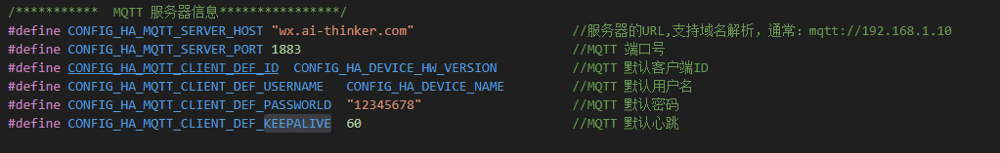
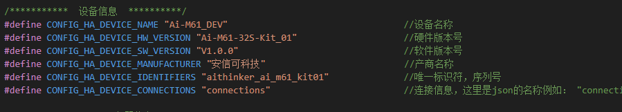
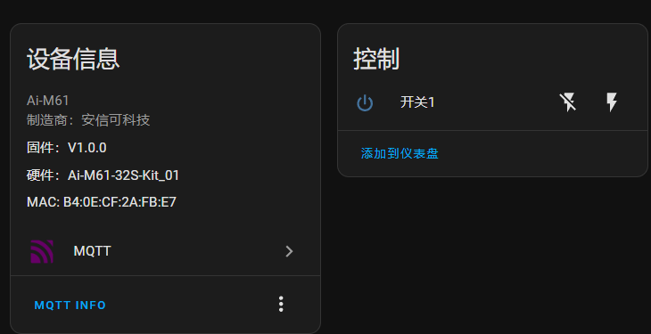

# HomeAssistant-C

## 移植说明

### 步骤一

把[HomeAssistant](./HomeAssistant-C/)文件夹复制到您的Ai-M6x工程当中,在工程的 *CMakeLists.txt*文档中引用库文件：
```
file(GLOB_RECURSE HA ${CMAKE_CURRENT_SOURCE_DIR}/HomeAssistant-C/*.c)
sdk_add_include_directories(HomeAssistant-C)
target_sources(app PRIVATE ${HA})
```
#### 修改MQTT连接信息

本源码中的连接信息可以暂时使用，但无法长期运行,默认连接信息如下：

>**MQTT host**: wx.ai-thinker.com
> 
>**MQTT port**: 1883
>
>**MQTT client ID**: Ai-M61-32S-Kit_01
>
>**MQTT user name**: Ai-M61_DEV
>
>**MQTT passworld**:12345678
>
>**MQTT keepalive**: 60s

可以在 [homeAssistantDevConfig.h](./HomeAssistant-C/homeAssistantDevConfig.h) 中修改这些信息。



### 步骤二

引用 *homeAssistantMQTT.h* 头文件，这样才能使用这些库函数

```
#include "homeAssistantMQTT.h"
```

然后进行HomeAssistant 的设备初始化，只需要一下代码即可：

```
void ha_event_cb(ha_event_t event, homeAssisatnt_device_t* ha_dev)
{
    //事件回调函数
}
 static homeAssisatnt_device_t ha_device;
 homeAssistant_device_init(&ha_device, ha_event_cb);
```

在事件回调函数中，可以处理数据，详细的回调事件可以查看*HomeAssistant_basic*例程中的 [main.c](./HomeAssistant_basic/main/main.c)。

### 步骤三

因为接入HomeAssistant 是通过MQTT的方式，所以你必须在WiFi连接互联网之后连接HomeAssistant，你可以在WiFi获取到IP地址的时候使用以下函数发起连接：

```
 homeAssistant_device_start();
```

例如：

>case AIIO_WIFI_EVENT_STA_GOT_IP:
 
            LOG_I("<<<<<<<<< CONNECTED GOT IP <<<<<<<<<<<");
            wifi_is_connect = true;
            aiio_wifi_rssi_get(&rssi);
            LOG_I("wifi cur_rssi = %d!!", rssi);
            aiio_wifi_sta_mac_get(mac);
            LOG_I("wifi mac = %02x%02x%02x%02x%02x%02x!!", mac[0], mac[1], mac[2], mac[3], mac[4], mac[5]);
            // aiio_wifi_sta_connect_ind_stat_get(&wifi_ind_stat);
            wifi_mgmr_sta_get_bssid(wifi_ind_stat.bssid);
            LOG_I("wifi sta_bssid = %02x%02x%02x%02x%02x%02x", wifi_ind_stat.bssid[0], wifi_ind_stat.bssid[1], wifi_ind_stat.bssid[2], wifi_ind_stat.bssid[3], wifi_ind_stat.bssid[4], wifi_ind_stat.bssid[5]);
            //下方开始连接服务器
            /************* 发起连接  ********/
            homeAssistant_device_start();
        break;

## 设备信息修改

设备信息是指设备名称，产商等之类的信息，本代码中，默认设备信息如下：

> Ai-M61
>
>制造商：安信可科技
>
>固件：V1.0.0
>
>硬件：Ai-M61-32S-Kit_01
>
>MAC: xx:xx:xx:xx:xx:xx

可以在 [homeAssistantDevConfig.h](./HomeAssistant-C/homeAssistantDevConfig.h) 中修改这些信息。



## 实体创建

这个例程当中已经做好了实体创建的函数，只需要配置实体的参数即可，函数介绍如下：

####  homeAssistant_device_add_entity(uint8_t* entity_type, void* ha_entity_list)

> **参数说明**
> **entity_type**: 实体类型，字符串变参数，在[homeAssistantDevConfig.h](./HomeAssistant-C/homeAssistantDevConfig.h) 中有参考
> **ha_entity_list**：实体描述，通常是实体的结构体

#### 例如：

```
 ha_sw_entity_t entity_sw1 = {
                .name = "开关1",
                .icon = "mdi:power",
                .unique_id = "switch1",
            };

homeAssistant_device_add_entity(CONFIG_HA_ENTITY_SWITCH, &entity_sw1);
```

## 设备上下线

#### homeAssistant_device_send_status(bool status)

> **参数说明**
> **status**: true 为上线，flase 为下线

这个函数必须在实体创建之后执行，否则实体无法在HomeAssistant 中显示


#### 例如：

```
 ha_sw_entity_t entity_sw1 = {
                .name = "开关1",
                .icon = "mdi:power",
                .unique_id = "switch1",
            };

homeAssistant_device_add_entity(CONFIG_HA_ENTITY_SWITCH, &entity_sw1);
homeAssistant_device_send_status(true);
```

在例程**HomeAssistant_basic**运行后，HomeAssistant 设备显示如下：



## 实体状态接收

当时HomeAssistant 有消息下发时，例如 开关控制命令下发，会触发事件，事件会在*event_cb* 回调函数中提示，回调的具体类型请查看[homeAssistantMQTT.h](./HomeAssistant-C/homeAssistantMQTT.h) 中的*ha_event_t*枚举。

#### 例如

HomeAssistant 下发开关控制，会触发**HA_EVENT_MQTT_COMMAND_SWITCH** 事件，这时候就能够在事件当中处理任务，比如开关类型的实体，当有命令下发后，被控实体会保存在***ha_dev->entity_switch->command_switch***对象当中，调用这个对象即可获取相应的开关状态。
在例程**HomeAssistant_basic**的处理方法：

```
  case HA_EVENT_MQTT_COMMAND_SWITCH:
            LOG_I("<<<<<<<<<<  HA_EVENT_MQTT_COMMAND_SWITCH");
            LOG_I(" switch %s is %s", ha_dev->entity_switch->command_switch->name, ha_dev->entity_switch->command_switch->switch_state?"true":"flase");//打印被控开关的信息
            int ret = homeAssistan_device_send_entity_state(CONFIG_HA_ENTITY_SWITCH, ha_dev->entity_switch->command_switch, ha_dev->entity_switch->command_switch->switch_state);//返回实际状态
            if (ret!=-1)LOG_I("%s send entity suceess,state=%s", ha_dev->entity_switch->command_switch->name, ha_dev->entity_switch->command_switch->switch_state?"true":"flase");
            break;
```

## 实体状态上报

HomeAssistant命令下发后，建议及时上报状态，提升UI交互体验。

#### homeAssistan_device_send_entity_state(uint8_t* entity_type, void* ha_entity_list, uint16_t state)

> **参数说明**
>
> **entity_type**: 实体类型，字符串变参数，在[homeAssistantDevConfig.h](./HomeAssistant-C/homeAssistantDevConfig.h) 中有参考
>
> **ha_entity_list**：实体描述，通常是实体的结构体
>
> **state**：状态，当为开关实体为: true 或 flase
>
> **返回值**：成功返回 消息ID，失败返回-1

#### 例如：

上报开关状态：关

```
 homeAssistan_device_send_entity_state(CONFIG_HA_ENTITY_SWITCH, &entity_sw1, 0);
```

