<div style="text-align: center;">

# Entity User-Manuals 实体使用指南

</div>

## 前言
### 实体添加函数
实体的添加，固定使用同一个函数,并使用`entity_type`区分：
```c
void homeAssistant_device_add_entity(char* entity_type, void* ha_entity_list)
```
>参数说明：`entity_type`为实体类型，`ha_entity_list`为实体信息结构体指针。


### 发送信息函数
#### 1. 按实体发送信息
HomeAssistant_MQTT-C 中，可以按照实体发送信息使用的函数，实行率较快，使用`entity_type`区分实体类型：
```c
int homeAssistant_device_send_entity_state(char* entity_type, void* ha_entity_list, unsigned short state);
```

>参数说明：`entity_type`为实体类型，`ha_entity_list`为实体信息结构体指针，`state`为状态值。

#### 2. 按照unique_id发送信息
HomeAssistant_MQTT-C 中，如果你找不到对应的实体类型，也可以直接使用`homeAssistant_device_quickly_send_data`函数发送信息：
```c
int homeAssistant_device_quickly_send_data(char* entity_type, char* unique_id, char* data)
```
> 参数说明：`entity_type`为实体类型，`unique_id`为实体唯一ID，`data`为需要发送的数据。

### entity_type 实体类型：

|实体名称| 实体类型 | 说明 | 是否已支持|
|:----:| :----: | :----: |:----: |
|[Alarm control panel]()| CONFIG_HA_ENTITY_ALARM_CONTROL_PANEL | 报警控制面板 实体 |:x:|
|[Binary sensor](#binary-sensor)| CONFIG_HA_ENTITY_BINARY_SENSOR | 高低电平传感器 实体 |:white_check_mark:|
|[Button](#button)| CONFIG_HA_ENTITY_BUTTON | 按钮实体 |:white_check_mark:|
|[Camera](#camera)| CONFIG_HA_ENTITY_CAMERA | 摄像头实体 |:x:|
|[Cover](#cover)| CONFIG_HA_ENTITY_COVER | 门类实体，窗帘、车门等 |:x:|
|[Device tracker](#device-tracker)| CONFIG_HA_ENTITY_DEVICE_TRACKER | 跟踪器实体，GPS定位等 |:x:|
|[Device Trigger](#device-trigger)| CONFIG_HA_ENTITY_DEVICE_TRIGGER | 触发器实体 |:white_check_mark:|
|[Event](#event)|CONFIG_HA_ENTITY_EVENT | 事件实体 |:x:|
|[Fan](#fan)|CONFIG_HA_ENTITY_FAN | 风扇实体 |:x:|
|[Humidifier](#humidifier) |CONFIG_HA_ENTITY_HUMIDIFIER | 加湿器实体 |:x:|
|[Image]() |CONFIG_HA_ENTITY_IMAGE | 图片实体 |:x:|
|[Climate/HVAC](#climatehvac) |CONFIG_HA_ENTITY_CLIMATE_HVAC | 空调实体 |:white_check_mark:|
|[Lawn mower]() |CONFIG_HA_ENTITY_LAWN_MOWER | 割草机实体 |:x:|
|[Light](#light) |CONFIG_HA_ENTITY_LIGHT | 灯实体 |:white_check_mark:|
|[Lock]() |CONFIG_HA_ENTITY_LOCK | 门锁实体 |:x:|
|[Notify]() |CONFIG_HA_ENTITY_NOTIFY | 通知实体 |:x:|
|[Number](#number) |CONFIG_HA_ENTITY_NUMBER | 数字实体 |:white_check_mark:|
|[Scene](#scene) |CONFIG_HA_ENTITY_SCENE | 场景实体 |:white_check_mark:|
|[Select](#select) |CONFIG_HA_ENTITY_SELECT | 选择器实体 |:white_check_mark:|
|[Sensor](#sensor) |CONFIG_HA_ENTITY_SENSOR | 传感器实体 |:white_check_mark:|
|[Siren]() |CONFIG_HA_ENTITY_SIREN | 警报器实体 |:x:|
|[Switch](#switch) |CONFIG_HA_ENTITY_SWITCH | 开关实体 |:white_check_mark:|
|[Update]() |CONFIG_HA_ENTITY_UPDATE | 更新实体 |:x:|
|[Tag scanner]() |CONFIG_HA_ENTITY_TAG_SCANNER | 标签扫描仪实体 |:x:|
|[Text](#text) |CONFIG_HA_ENTITY_TEXT | 文本实体 |:white_check_mark:|
|[Vacuum]() |CONFIG_HA_ENTITY_VACUUM | 真空吸尘器实体 |:x:|
|[Valve]() |CONFIG_HA_ENTITY_VALVE | 阀门实体 |:x:|
|[Water heater]() |CONFIG_HA_ENTITY_WATER_HEATER | 热水器实体 |:x:|

### HomeAssistant MQTT 控制事件
HomeAssistant MQTT 控制事件用于接收来自HomeAssistant的控制指令，例如开关、按钮、数字等实体的控制指令。每种事件需要开启对应的实体资源才可以使用。事件列表如下：
| 事件类型 | 权限 |说明 |
| :----: | :----: |:----: |
| HA_EVENT_NONE | / |无事件 |
| HA_EVENT_MQTT_CONNECED | / |服务器连接成功事件 |
| HA_EVENT_MQTT_DISCONNECT | / |服务器断开事件 |
| HA_EVENT_HOMEASSISTANT_STATUS_ONLINE | / |HomeAssisstant 在线事件 |
| HA_EVENT_HOMEASSISTANT_STATUS_OFFLINE | / |HomeAssistant 掉线事件 |
| HA_EVENT_MQTT_COMMAND_SWITCH | 需开启Switch资源 |服务器下发开关命令事件，当在HA操作开关时，会触发这个事件 |
| HA_EVENT_MQTT_COMMAND_LIGHT_SWITCH | 需开启light资源 |light 灯的开关事件 |
| HA_EVENT_MQTT_COMMAND_LIGHT_RGB_UPDATE | 需开启light资源 |light 灯的RGB 颜色下发事件 |
| HA_EVENT_MQTT_COMMAND_LIGHT_BRIGHTNESS | 需开启light资源 |light 灯的亮度数据下发事件 |
| HA_EVENT_MQTT_COMMAND_TEXT_VALUE | 需开启Text资源  |服务器下发text内容事件 |
|HA_EVENT_MQTT_COMMAND_NUMBER_VALUE| 需开启Number资源 |服务器下发number内容事件 |
| HA_EVENT_MQTT_COMMAND_CLIMATE_HVAC_POWER | 需开启climateHVAC资源  |服务器下发的空调开关事件 |
| HA_EVENT_MQTT_COMMAND_CLIMATE_HVAC_MODES | 需开启climateHVAC资源 |设置模式 |
| HA_EVENT_MQTT_COMMAND_CLIMATE_HVAC_TEMP | 需开启climateHVAC资源 |设置温度 |
| HA_EVENT_MQTT_COMMAND_CLIMATE_HVAC_FAN_MODES | 需开启climateHVAC资源 |设置风力 |
| HA_EVENT_MQTT_COMMAND_SELECT_VALUE | 需开启select资源 |服务器下发select内容事件 |
| HA_EVENT_MQTT_COMMAND_BUTTON | 需开启button资源 |服务器下发button内容事件 |
| HA_EVENT_MQTT_ERROR | / |服务器错误事件 |

## Switch 

Switch 实体是HomeAssistant中的一种设备类型，用于表示可以打开或关闭的设备，例如灯泡、插座等。
### 步骤1.开启Switch资源

任何实体，在使用之前都需要开启对应的资源，Switch资源,在HomeAssistant_MQTT-C 中，需要通过以下方式开启Switch资源：
- 1. 打开[homeAssistantDevConfig.h](../HomeAssistant-C/homeAssistantDevConfig.h)
- 2. 设置`CONFIG_ENTITY_ENABLE_SWITCH`为`1`<br>
如：<br>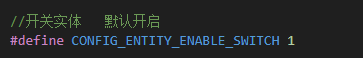

### 步骤2.创建Switch实体v

> :warning:**前提条件:**<br>
> - 1.创建实体的前提条件是已经开启了对应的资源，例如Switch实体，需要开启Switch资源。<br>
> - 2.必须设备上线之前创建好实体，否则设备上线后，HomeAssistant无法识别实体。

Switch实体，在HomeAssistant_MQTT-C 中，需要通过以下方式创建实体：
- 1. 创建 Switch 实体信息结构体，并初始化。必填参数有`name`、`unique_id`，其他参数可选。<br>
```c
 ha_sw_entity_t sw = {
                .name = "开关",
                .unique_id = "sw_1",
                .icon = "mdi:power",//图标：可选
            };
```
- 2. 调用`homeAssistant_device_add_entity`函数，将实体添加到设备中，如：
```c
 ha_sw_entity_t sw = {
                .name = "开关",
                .unique_id = "sw_1",
               .icon = "mdi:power",
            };
homeAssistant_device_add_entity(CONFIG_HA_ENTITY_SWITCH, &sw);
```
>其中，`CONFIG_HA_ENTITY_SWITCH`为实体类型，`&sw`为实体信息结构体指针。

#### Switch 实体参数

|参数名|权限<br>:red_circle:必选 :green_circle:可选|类型|描述|
|:----:|:----:|:----:|:----:|
|name|:red_circle:|char*|实体名称|
|entity_config_topic|:green_circle:|char*|实体自动发现需要的topic，已经自动赋值，可以不配置|
|object_id|:green_circle:|char*|实体 工程id 可以为NULL|
|availability_mode|:green_circle:|char*|实体上下线的模式 可以为NULL|
|availability_template|:green_circle:|char*|实体上下线的数据格式，建议为NULL，采用默认|
|availability_topic|:green_circle:|char*|实体上下线上报的Topic,建议保持默认|
|command_topic|:green_circle:|char*|命令接收的Topic,需要订阅|
|state_topic|:green_circle:|char*|上报给HA的数据的Topic，默认已配置|
|device_class|:green_circle:|char*|设备类型，可以留空|
|enabled_by_default|:green_circle:|bool|默认LED的状态|
|encoding|:green_circle:|char*|编码方式|
|entity_category|:green_circle:|char*|实体属性，保持NULL|
|icon|:green_circle:|char*|图标|
|json_attributes_template|:green_circle:|char*|json 数据模板|
|optimistic|:green_circle:|char*|记忆模式|
|payload_available|:green_circle:|char*|在线消息内容 默认"online"|
|payload_not_available|:green_circle:|char*|离线消息内容 默认"offline"|
|payload_off|:green_circle:|char*|开关状态内容，默认"ON"|
|payload_on|:green_circle:|char*|开关状态内容，默认"OFF"|
|qos|:green_circle:|int|消息服务质量|
|retain|:green_circle:|bool|是否保留该信息|
|state_off|:green_circle:|char*|状态 关|
|state_on|:green_circle:|char*|状态 开|
|unique_id|:red_circle:|char*|唯一的识别码，这个必须配置|
|value_template|:green_circle:|char*|数据格式|

#### icon 设置：请参考[icon章节](#icon)
#### Switch device class 参数

Device Class 是HomeAssistant中的预设的参数，用于描述设备的功能，例如开关、温度传感器等。Device Class 可以帮助HomeAssistant更好地理解设备的功能，并为其提供相应的配置和操作，例如自动分配`icon`。<br>
而Switch 实体的预设Device Class 参数只有三个，分别为：

- none:通用开关。 这是默认设置，无需设置,如果设置了这个参数，会导致实体无法显示。
- outlet:电源插座。
- switch:通用开关。<br>

它们三个对应在HomeAssistant的样式：

|名称|配置方法|样式|功能|
|:----:|:----:|:----:|:----:|
|outlet|`.device_class="outlet"`||电源插座|
|switch|`.device_class="switch"`|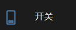|通用开关|

### 步骤3.接收控制指令
HomeAssistant_MQTT-C 中，Switch实体的控制指令，通过`ha_event_cb`回调函数接收，会触发`HA_EVENT_MQTT_COMMAND_SWITCH`事件，可以使用 `power_state` 判断开关指令:`0`为关，`1`为开。<br>
示例如下：
```c
void ha_event_cb(ha_event_t event, homeAssisatnt_device_t* ha_dev)
{
    switch (event)
    {
        // ... 其他事件
        case HA_EVENT_MQTT_COMMAND_SWITCH:
        {
            // 接收开关控制指令
              HA_LOG_I("<<<<<<<<<< HA_EVENT_MQTT_COMMAND_SWITCH=%s\r\n", ha_dev->entity_switch->command_switch->switch_state?"ON":"OFF");
            break;
        }
        // ... 其他事件
    }
}
```

### 步骤4.发送开关状态
HomeAssistant_MQTT-C 中，Switch实体的状态，通过`homeAssistant_device_entity_update`函数发送，如：
```c
  homeAssistant_device_send_entity_state(CONFIG_HA_ENTITY_SWITCH, &sw, 1);
```
>其中，`CONFIG_HA_ENTITY_SWITCH`为实体类型，`&sw`为实体信息结构体指针，`1`为开关状态，`1`为开，`0`为关。


## Sensor 

Sensor 实体是HomeAssistant中的一种设备类型，用于表示可以测量某种状态的设备，例如温度、湿度、光照强度等。

### 步骤1.开启Sensor资源
任何实体，在使用之前都需要开启对应的资源，Sensor资源,在HomeAssistant_MQTT-C 中，需要通过以下方式开启Sensor资源：
- 1. 打开[homeAssistantDevConfig.h](../HomeAssistant-C/homeAssistantDevConfig.h)
- 2. 设置`CONFIG_ENTITY_ENABLE_SENSOR`为`1`<br>
如：<br>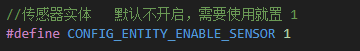

### 步骤2.创建Sensor实体
> :warning:**前提条件:**<br>
> - 1.创建实体的前提条件是已经开启了对应的资源，例如Sensor实体，需要开启Sensor资源。<br>
> - 2.必须设备上线之前创建好实体，否则设备上线后，HomeAssistant无法识别实体。

Sensor实体，在HomeAssistant_MQTT-C 中，需要通过以下方式创建实体：
- 1. 创建 Sensor 实体信息结构体，并初始化。必填参数有`name`、`unique_id`其他参数可选。<br>
  ```c
   ha_sensor_entity_t sensor = {
                .name = "温度",
                .unique_id = "sensor_1",
            };
  ```
- 2. 调用`homeAssistant_device_add_entity`函数，将实体添加到设备中，如：
  ```c
   ha_sensor_entity_t sensor = {
                .name = "温度",
                .unique_id = "sensor_1",
            };
  homeAssistant_device_add_entity(CONFIG_HA_ENTITY_SENSOR, &sensor);
  ```
  >其中，`CONFIG_HA_ENTITY_SENSOR`为实体类型，`&sensor`为实体信息结构体指针。

#### Sensor 实体参数
|参数名|权限<br>:red_circle:必选 :green_circle:可选|类型|描述|
|:----:|:----:|:----:|:----|
|name|:red_circle:|char*|实体名称|
|entity_config_topic|:green_circle:|char*|配置主题|
|config_data|:green_circle:|char*|配置数据|
|object_id|:green_circle:|char*|对象ID|
|unique_id|:red_circle:|char*|唯一的识别码，这个必须配置|
|availability_mode|:green_circle:|char*|可用性模式|
|availability_template|:green_circle:|char*|可用性模板|
|availability_topic|:green_circle:|char*|可用性主题|
|[device_class](#sensor-device-class-参数)|:green_circle:|ha_sensor_class_t|设备类|
|payload_available|:green_circle:|char*|可用负载|
|payload_not_available|:green_circle:|char*|不可用负载|
|suggested_display_precision|:green_circle:|unsigned short|建议显示精度|
|enabled_by_default|:green_circle:|bool|默认启用|
|entity_category|:green_circle:|char*|实体类别|
|icon|:green_circle:|char*|图标|
|json_attributes_template|:green_circle:|char*|JSON属性模板|
|json_attributes_topic|:green_circle:|char*|JSON属性主题|
|last_reset_value_template|:green_circle:|char*|最后重置值模板|
|qos|:green_circle:|unsigned short|服务质量|
|retain|:green_circle:|bool|保留|
|state_class|:green_circle:|char*|状态类|
|state_topic|:green_circle:|char*|状态主题|
|unit_of_measurement|:green_circle:|char*|单位|
|value_template|:green_circle:|char*|值模板|
|expire_after|:green_circle:|unsigned short|过期时间|
|force_update|:green_circle:|bool|强制更新|
|sensor_data|:green_circle:|void*|传感器数据|

#### icon 设置：请参考[icon章节](#icon)

#### Sensor device class 参数

Sensor 实体预设的Device Clash有很多，HomeAssistant_MQTT-C 中，通过`ha_sensor_class_t`枚举类型定义，列表如下：

|类型|配置方式|描述|
|:----:|:----|:----:|
|Class_None| \\ | 通用传感器。 这是默认设置，无需设置。|
|Class_apparent_power|`.device_class=Class_apparent_power`|功率计，单位：VA
|Class_aqi| `.device_class=Class_aqi` |空气质量指数(无单位)|
|Class_area|`.device_class=Class_area`|面积，单位：m², cm², km², mm², in², ft², yd², mi², ac, ha|
|Class_atmospheric_pressure|`.device_class=Class_atmospheric_pressure`|大气压力，单位：cbar, bar, hPa, mmHg, inHg, kPa, mbar, Pa 或 psi|
|Class_battery|`.device_class=Class_battery`|电池电量，单位：%|
|Clase_blood_glucose_concentration|`.device_class=Clase_blood_glucose_concentration`|血氧浓度，单位：mg/dL,mmol/L|
|Class_carbon_dioxide|`.device_class=Class_carbon_dioxide`|二氧化碳浓度，单位：ppm|
|Class_carbon_monoxide|`.device_class=Class_carbon_monoxide`|一氧化碳浓度，单位：ppm|
|Class_current|`.device_class=Class_current`|电流，单位：A，mA|
|Class_data_rate|`.device_class=Class_data_rate`|传输速率，单位：bit/s, kbit/s, Mbit/s, Gbit/s, B/s, kB/s, MB/s, GB/s, KiB/s, MiB/s 或 GiB/s|
|Class_data_size|`.device_class=Class_data_size`|数据大小，单位：bit, kbit, Mbit, Gbit, B, kB, MB, GB, TB, PB, EB, ZB, YB, KiB, MiB, GiB, TiB, PiB, EiB, ZiB 或 YiB|
|Class_date|`.device_class=Class_date`|日期字符串（ISO 8601）|
|Class_distance|`.device_class=Class_distance`|距离，单位：km, m, cm, mm, mi, nmi, yd, 或 in|
|Class_duration|`.device_class=Class_duration`|持续时间，单位：d, h, min, s, 或 ms|
|Class_energy|`.device_class=Class_energy`|能耗，单位：J, kJ, MJ, GJ, mWh, Wh, kWh, MWh, GWh, TWh, cal, kcal, Mcal, 或 Gcal|
|Class_energy_storage|`.device_class=Class_energy_storage`|能量存储，单位：J, kJ, MJ, GJ, mWh, Wh, kWh, MWh, GWh, TWh, cal, kcal, Mcal, 或 Gcal|
|Class_ha_enum|`.device_class=Class_ha_enum`|一组有限的（非数字）状态|
|Class_frequency|`.device_class=Class_frequency`|频率，单位：Hz, kHz, MHz, 或 GHz|
|Class_gas|`.device_class=Class_gas`|气体容量，单位：m³, ft³ 或 CCF|
|Class_humidity| `.device_class=Class_humidity`|空气湿度，单位：%|
|Class_illuminance|`.device_class=Class_illuminanc`|光照度，单位： lx|
|Class_irradiance|`.device_class=Class_irradiance`|辐射，单位：W/m² 或 BTU/(h⋅ft²)|
|Class_moisture|`.device_class=Class_moisture`|水分占比，单位：%|
|Class_monetary|`.device_class=Class_monetary`|货币（[ISO 4217](https://en.wikipedia.org/wiki/ISO_4217#Active_codes)）|
|Class_nitrogen_dioxide|`.device_class=Class_nitrogen_dioxide`|二氧化氮，单位：µg/m³|
|Class_nitrogen_monoxide|`.device_class=Class_nitrogen_monoxide`|一氧化氮，单位： µg/m³|
|Class_nitrous_oxide|`.device_class=Class_nitrous_oxide`|一氧化二氮，单位：µg/m³|
|Class_ozone|`.device_class=Class_ozone`|臭氧，单位： µg/m³|
|Class_ph|`.device_class=Class_ph`|PH，单位：pH|
|Class_pm1|`.device_class=Class_pm1`|PM1，单位：µg/m³|
|Class_pm25|`.device_class=Class_pm25`|PM2.5，单位：µg/m³|
|Class_pm10|`.device_class=Class_pm10`|PM10，单位：µg/m³|
|Class_power_factor|`.device_class=Class_power_factor`|功率因数（无单位），单位可以是无或 %|
|Class_power|`.device_class=Class_power`|功率，单位：mW, W, kW, MW, GW 或 TW|
|Class_precipitation|`.device_class=Class_precipitation`|降水，单位：cm, in 或 mm|
|Class_precipitation_intensity|`.device_class=Class_precipitation_intensity`|降水强度，单位：in/d, in/h, mm/d 或 mm/h|
|Class_pressure|`.device_class=Class_pressure`|压力，单位：Pa, kPa, hPa, bar, cbar, mbar, mmHg, inHg 或 psi|
|Class_reactive_power|`.device_class=Class_reactive_power`|无功功率，单位：var|
|Class_signal_strength|`.device_class=Class_signal_strength`|信号强度，单位：dB 或 dBm|
|Class_sound_pressure|`.device_class=Class_sound_pressure`|声压，单位：dB 或 dBm|
|Class_speed|`.device_class=Class_speed`|速度，单位：ft/s, in/d, in/h, in/s, km/h, kn, m/s, mph, mm/d, 或 mm/s|
|Class_sulphur_dioxide|`.device_class=ass_sulphur_dioxide`|二氧化硫，单位：µg/m³|
|Class_temperature|`.device_class=Class_temperature`|温度，单位：°C, °F 或 K|
|Class_timestamp|`.device_class=Class_timestamp`|时间戳(ISO 8601)|
|Class_volatile_organic_compounds|`.device_class=Class_volatile_organic_compounds`|挥发性有机化合物，单位：µg/m³|
|Class_volatile_organic_compounds_parts|`.device_class=Class_volatile_organic_compounds_parts`|挥发性有机化合物部分，单位：ppm 或 ppb|
|Class_voltage|`.device_class=Class_voltage`|电压，单位：V, mV, µV, kV, MV|
|Class_volume|`.device_class=Class_volume`|体积，单位： L, mL, gal, fl. oz., m³, ft³, 或 CCF|
|Class_volume_flow_rate|`.device_class=Class_volume_flow_rate`|体积流量，单位： m³/h, ft³/min, L/min, gal/min, 或 mL/s|
|Class_volume_storage|`.device_class=Class_volume_storage`|体积存储，单位：L, mL, gal, fl. oz., m³, ft³, 或 CCF|
|Class_water|`.device_class=Class_water`|水，单位：L, gal, m³, ft³, 或 CCF|
|Class_weight|`.device_class=Class_weight`|重量，单位：kg, g, mg, µg, oz, lb, 或 st|
|Class_wind_speed|`.device_class=Class_wind_speed`|风速，单位：Beaufort, ft/s, km/h, kn, m/s, 或 mph|

### 步骤3.发送传感器值

#### 整型传感器值

整型的传感器值，例如低精度的温度传感器，湿度传感器等，在发送数据时，只需要发送没有小数点的数据，可以直接使用`homeAssistant_device_send_entity_state`函数直接发送，例如：
```c
homeAssistant_device_send_entity_state(CONFIG_HA_ENTITY_SENSOR, &sensor, 21);
```

#### 有符号传感器值（包含小数点）

带小数点传感器值，例如高精度的温度传感器，在发送数据时，需要先把数值装换成字符串，再给`sensor_data`赋值，然后再使用`homeAssistant_device_send_entity_state`函数发送，例如：
```c
char sensor_data[10];
sprintf(sensor_data, "%.2f", 21.23);
sensor.sensor_data = sensor_data;
homeAssistant_device_send_entity_state(CONFIG_HA_ENTITY_SENSOR, &sensor, 0);
```

## Binary sensor
Bianry sensor 即二进制传感器，例如开关，门磁，窗磁等，二进制传感器只有开和关两种状态.

### 步骤1.开启Binary sensor资源
Bianry sensor 需要开启`CONFIG_ENTITY_ENABLE_BINARY_SENSOR`资源，需要通过以下方式开启Bianry sensor资源：
- 1. 打开[homeAssistantDevConfig.h](../HomeAssistant-C/homeAssistantDevConfig.h)
- 2. 设置`CONFIG_ENTITY_ENABLE_BINARY_SENSOR`为`1`<br>
如：<br>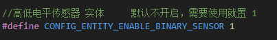

### 步骤2.创建Binary sensor实体
> :warning:**前提条件:**<br>
> - 1.创建实体的前提条件是已经开启了对应的资源<br>
> - 2.必须设备上线之前创建好实体，否则设备上线后，HomeAssistant无法识别实体。

- 1. 创建实体，例如门磁开关，在创建实体时，需要设置`name`和`unique_id`两个必选参数，例如：
  ```c
   ha_Bsensor_entity_t sensor = {
                .name = "门磁开关",
                .unique_id = "sensor_1",
            };
  ```
  > 其中,`name`为实体名称，`unique_id`为实体唯一标识，`unique_id`必须为全局唯一，不能重复。
- 2. 调用`homeAssistant_device_add_entity`函数，将实体添加到设备中，如：
  ```c
     ha_Bsensor_entity_t sensor = {
                .name = "门磁开关",
                .unique_id = "sensor_1",

            };
    homeAssistant_device_add_entity(CONFIG_HA_ENTITY_BINARY_SENSOR, &sensor);
  ```
#### icon 设置：请参考[icon章节](#icon)

#### Bianry sensor 所有可配置参数
|参数名称|权限<br>:red_circle:必选 :green_circle:可选|参数类型|参数说明|
|:---:|:---:|:---:|:---:|
|name|:red_circle:|char*|实体名称|
|entity_config_topic|:green_circle:|char*|实体配置主题|
|config_data|:green_circle:|char*|实体配置数据|
|object_id|:green_circle:|char*|实体对象ID|
|unique_id|:red_circle:|char*|实体唯一标识|
|availability_mode|:green_circle:|char*|实体可用性模式|
|availability_template|:green_circle:|char*|实体可用性模板|
|availability_topic|:green_circle:|char*|实体可用性主题|
|payload_available|:green_circle:|char*|实体可用性payload|
|payload_not_available|:green_circle:|char*|实体不可用性payload|
|[device_class](#bianry-sensor-device-class-参数)|:green_circle:|ha_Bsensor_class_t|实体设备类型|
|entity_category|:green_circle:|char*|实体类别|
|icon|:green_circle:|char*|实体图标|
|json_attributes_template|:green_circle:|char*|实体JSON属性模板|
|json_attributes_topic|:green_circle:|char*|实体JSON属性主题|
|qos|:green_circle:|int|服务质量QoS|
|retain|:green_circle:|bool|信息是否保留|
|state_class|:green_circle:|char*|上报信息类型|
|state_topic|:green_circle:|char*|实体状态主题|
|value_template|:green_circle:|char*|实体值模板|
|expire_after|:green_circle:|unsigned short|实体过期时间|
|force_update|:green_circle:|bool|实体是否强制更新|
|enabled_by_default|:green_circle:|bool|实体是否默认启用|
|state|:green_circle:|bool|实体状态|
|payload_off|:green_circle:|char*|实体关闭payload|
|payload_on|:green_circle:|char*|实体打开payload|

#### Bianry sensor device class 参数

|参数名称|配置方式|参数说明|
|:---:|:---:|:---:|
|Bclass_None| \\ | 无参数，不需要配置此选项，否则会导致无法创建实体 |
|Bclass_battery|`.device_class=Bclass_battery`|`on`表示低电平，`off`表示正常|
|Bclass_battery_charging|`.device_class=Bclass_battery_charging`|`on`表示电池低压，`off`表示正常|
|Bclass_carbon_monoxide|`.device_class=Bclass_carbon_monoxide`|`on`表示检测到一氧化碳，`off`表示未检测到|
|Bclass_cold|`.device_class=Bclass_cold`|`on`表示温度过低，`off`表示正常|
|Bclass_connectivity|`.device_class=Bclass_connectivity`|`on`表示设备在线，`off`表示设备离线|
|Bclass_door|`.device_class=Bclass_door`|`on`表示门打开，`off`表示门关闭|
|Bclass_garage_door|`.device_class=Bclass_garage_door`|`on`表示门打开，`off`表示门关闭|
|Bclass_gas|`.device_class=Bclass_gas`|`on`表示检测到燃气，`off`表示未检测到|
|Bclass_heat|`.device_class=Bclass_heat`|`on`表示温度过高，`off`表示正常|
|Bclass_light|`.device_class=Bclass_light`|`on`表示检测到光线，`off`表示未检测到|
|Bclass_lock|`.device_class=Bclass_lock`|`on`表示门锁打开，`off`表示门锁关闭|
|Bclass_moisture|`.device_class=Bclass_moisture`|`on`表示检测到湿度，`off`表示未检测到|
|Bclass_motion|`.device_class=Bclass_motion`|`on`表示检测到运动，`off`表示未检测到|
|Bclass_moving|`.device_class=Bclass_moving`|`on`表示运动中，`off`表示静止|
|Bclass_occupancy|`.device_class=Bclass_occupancy`|`on`表示有人，`off`表示无人|
|Bclass_opening|`.device_class=Bclass_opening`|`on`表示打开，`off`表示关闭|
|Bclass_plug|`.device_class=Bclass_plug`|`on`表示插上电源，`off`表示拔掉电源|
|Bclass_power|`.device_class=Bclass_power`|`on`表示有电，`off`表示没电|
|Bclass_presence|`.device_class=Bclass_presence`|`on`表示有人，`off`表示无人|
|Bclass_problem|`.device_class=Bclass_problem`|`on`表示有问题，`off`表示正常|
|Bclass_running|`.device_class=Bclass_running`|`on`表示运行中，`off`表示停止|
|Bclass_afety|`.device_class=Bclass_afety`|`on`表示安全，`off`表示不安全|
|Bclass_smoke|`.device_class=Bclass_smoke`|`on`表示检测到烟雾，`off`表示未检测到|
|Bclass_sound|`.device_class=Bclass_sound`|`on`表示检测到声音，`off`表示未检测到|
|Bclass_tamper|`.device_class=Bclass_tamper`|`on`表示被破坏，`off`表示正常|
|Bclass_update|`.device_class=Bclass_update`|`on`表示有更新，`off`表示无更新|
|Bclass_vibration|`.device_class=Bclass_vibration`|`on`表示检测到振动，`off`表示未检测到|
|Bclass_window|`.device_class=Bclass_window`|`on`表示窗打开，`off`表示窗关闭|

### 步骤3.发送传感器状态
二进制传感器值，只有 `0`和`1`，`0`表示关闭，`1`表示打开。所以只需要给对应的传感器发送状态就行：

```c
homeAssistant_device_send_entity_state(CONFIG_HA_ENTITY_BINARY_SENSOR, &sensor, 1);//打开
homeAssistant_device_send_entity_state(CONFIG_HA_ENTITY_BINARY_SENSOR, &sensor, 0);//关闭
```

## Light    

Light 实体是HomeAssistant中的一种实体类型，用于表示可以控制灯光及亮度的设备，例如彩灯、灯条、亮度可控的灯。Light实体可以接收开关指令，颜色指令、亮度指令等。<br>
Light 实体在对颜色的控制有多种方式:`RGB`,`RGBW`,`RGBWW`,`HS`,`X-Y`,目前,HomeAssistant_MQTT-C只支持`RGB`方式:
|颜色控制类型|控制方式|实现状态<br> :heavy_check_mark::支持 ,:x: :不支持|
|:---:|:---:|:---:|
|RGB|参数:`red`(红色)、`green`(绿)、`blue`(蓝)|:heavy_check_mark:|
|RGBW|参数:`red`、`green`、`blue`、`white`(白色通道)|:x:|
|RGBWW|参数:`red`、`green`、`blue`、`warm_white`(暖白色通道)、`cold_white`(冷白色通道)|:x:|
|HS|参数:`hue`(色相)、`saturation`(饱和度)|:x:|
|X-Y|参数:`x`、`y`|:x:|

### 步骤1.开启Light资源
Light 需要开启`CONFIG_ENTITY_ENABLE_LIGHT`资源，需要通过以下方式开启Bianry sensor资源：
- 1. 打开[homeAssistantDevConfig.h](../HomeAssistant-C/homeAssistantDevConfig.h)
- 2. 设置`CONFIG_ENTITY_ENABLE_LIGHT`为`1`<br>
如：<br>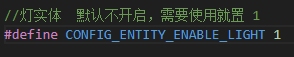

### 步骤2.创建Light实体
> :warning:**前提条件:**<br>
> - 1.创建实体的前提条件是已经开启了对应的资源<br>
> - 2.必须设备上线之前创建好实体，否则设备上线后，HomeAssistant无法识别实体。

- 1. 创建实体信息,需要把light 的信息填写完整(结构体:ha_lh_entity_t)，如：
  ```c
    ha_lh_entity_t light = {
                .name = "灯",
                .unique_id = "light_1",
                .rgb.rgb_command_topic = "light_1/rgb/set",
                .rgb.rgb_state_topic = "light_1/rgb/state",
                .rgb.red = 0,
                .rgb.green = 0xff,
                .rgb.blue = 0xff,
            };
  ```
  >其中，`rgb_command_topic`是控制rgb灯的指令主题，`rgb_state_topic`是rgb灯状态的主题，`red`、`green`、`blue`是rgb灯的初始颜色值。

- 2. 调用`homeAssistant_device_add_entity`函数，将实体添加到设备中，如：
  ```c
    ha_lh_entity_t light = {
                .name = "灯",
                .unique_id = "light_1",
                .rgb.rgb_command_topic = "light_1/rgb/set",
                .rgb.rgb_state_topic = "light_1/rgb/state",
                .rgb.red = 0,
                .rgb.green = 0xff,
                .rgb.blue = 0xff,
            };
    homeAssistant_device_add_entity(CONFIG_HA_ENTITY_LIGHT, &light);
  ```
#### Light 实体参数

|参数名称|权限<br>:red_circle:必选 :green_circle:可选|参数类型|参数说明|
|:----:|:----:|:----:|:----:|
|name|:red_circle:|char*|实体名称|
|entity_config_topic|:red_circle:|char*|实体配置主题|
|object_id|:green_circle:|char*|实体对象id|
|availability_mode|:green_circle:|char*|实体可用模式|
|availability_template|:green_circle:|char*|实体可用模板|
|availability_topic|:green_circle:|char*|实体可用主题|
|command_topic|:green_circle:|char*|实体控制主题|
|state_topic|:green_circle:|char*|实体状态主题|
|enabled_by_default|:green_circle:|bool|是否默认启用|
|encoding|:green_circle:|char*|编码|
|entity_category|:green_circle:|char*|实体类别|
|icon|:green_circle:|char*|图标|
|json_attributes_template|:green_circle:|char*|json属性模板|
|optimistic|:green_circle:|bool|乐观|
|payload_available|:green_circle:|char*|可用负载|
|payload_not_available|:green_circle:|char*|不可用负载|
|payload_off|:green_circle:|char*|关闭负载|
|payload_on|:green_circle:|char*|打开负载|
|qos|:green_circle:|int|服务质量|
|config_data|:green_circle:|char*|配置数据|
|brightness|:green_circle:|struct light_brightness_t|亮度|
|color_temp|:green_circle:|struct light_color_temp_t|色温|
|effect|:green_circle:|struct light_effect_t|效果|
|hs|:green_circle:|struct light_hs_t|色调饱和度|
|hs.command_topic|:red_circle:|char*|色调饱和度控制主题|
|hs.state_topic|:red_circle:|char*|色调饱和度状态主题|
|hs.hue|:green_circle:|int|色调|
|hs.saturation|:green_circle:|int|饱和度|
|rgb|:red_circle:|struct light_rgb_t|RGB|
|rgb.rgb_command_topic|:red_circle:|char*|rgb控制主题|
|rgb.rgb_state_topic|:red_circle:|char*|rgb状态主题|
|rgb.red|:green_circle:|int|红色值|
|rgb.green|:green_circle:|int|绿色值|
|rgb.blue|:green_circle:|int|蓝色值|
|rgbw|:green_circle:|struct light_rgbw_t|RGBW|
|rgbw.rgbw_command_topic|:red_circle:|char*|rgbw控制主题|
|rgbw.rgbw_state_topic|:red_circle:|char*|rgbw状态主题|
|rgbw.red|:green_circle:|int|红色值|
|rgbw.green|:green_circle:|int|绿色值|
|rgbw.blue|:green_circle:|int|蓝色值|
|rgbw.white|:green_circle:|int|白色值|
|rgbww|:green_circle:|struct light_rgbww_t|RGBWW|
|rgbww.rgbww_command_topic|:red_circle:|char*|rgbww控制主题|
|rgbww.rgbww_state_topic|:red_circle:|char*|rgbww状态主题|
|rgbww.red|:green_circle:|int|红色值|
|rgbww.green|:green_circle:|int|绿色值|
|rgbww.blue|:green_circle:|int|蓝色值|
|rgbww.white|:green_circle:|int|白色值|
|rgbww.cold_white|:green_circle:|int|冷白色值|
|white|:green_circle:|struct light_white_t|白色|
|xy|:green_circle:|struct light_xy_t|xy|
|xy.command_topic|:red_circle:|char*|xy控制主题|
|xy.state_topic|:red_circle:|char*|xy状态主题|
|xy.x|:green_circle:|int|x值|
|xy.y|:green_circle:|int|y值|
|retain|:green_circle:|bool|保留|
|state_off|:green_circle:|char*|关闭状态|
|state_on|:green_circle:|char*|打开状态|
|unique_id|:green_circle:|char*|唯一id|
|value_template|:green_circle:|char*|值模板|

### 步骤3.接收控制指令
Light实体可以接收开关指令，颜色指令、亮度指令等。当设备收到指令后，会触发`HA_EVENT_MQTT_COMMAND_LIGHT_SWITCH`和`HA_EVENT_MQTT_COMMAND_LIGHT_RGB_UPDATE`,事件相关描述请参考[ HomeAssistant MQTT 控制事件](#homeassistant-mqtt-控制事件).<br>用户可以在这两个事件中处理指令,如:

```c
void ha_event_cb(ha_event_t event, homeAssisatnt_device_t* ha_dev)
{
    switch (event)
    {
        //其他事件
         case HA_EVENT_MQTT_COMMAND_LIGHT_SWITCH:
            HA_LOG_I("<<<<<<<<<< HA_EVENT_MQTT_COMMAND_LIGHT_SWITCH=%s\r\n", ha_dev->entity_light->command_light->light_state ?"ON":"OFF");
         
            break;
        case HA_EVENT_MQTT_COMMAND_LIGHT_RGB_UPDATE:
            HA_LOG_I("<<<<<<<<<< HA_EVENT_MQTT_COMMAND_LIGHT_RGB_UPDATE=%d,%d,%d\r\n", ha_dev->entity_light->command_light->rgb.red, ha_dev->entity_light->command_light->rgb.green, ha_dev->entity_light->command_light->rgb.blue);
            break;
        //其他事件
    }
}
```
### 步骤4.发送状态
#### 开关状态
发送Light的开关状态和Switch的发送方式一样,只需要调用`homeAssistant_device_send_entity_state`函数即可,如:

```c
 homeAssistant_device_send_entity_state(CONFIG_HA_ENTITY_LIGHT, &light,1);

```
>`CONFIG_HA_ENTITY_LIGHT`是实体的类型，`&light`是实体的指针，`1`是开关状态，1表示开，0表示关。

#### 当前颜色
发送Light的当前颜色值,只需要通过light的`red`,`green`,`blue`字段即可,如:

```c
light.rgb.red = 0xff;
light.rgb.green = 0x03;
light.rgb.blue = 0x04;
homeAssistant_device_send_entity_state(CONFIG_HA_ENTITY_LIGHT, &light,1);
```
>其中`CONFIG_HA_ENTITY_LIGHT`是实体的类型，`&light`是实体的指针，`1`是开关状态，1表示开，0表示关。

## Text  
Text 实体，即文本实体，在HomeAssistant中可以用来表示文本信息。在HomeAssistant中，Text实体可以接收文本指令.
### 步骤1.开启Text资源
Text 需要开启`CONFIG_ENTITY_ENABLE_TEXT`资源，需要通过以下方式开启Text资源：
- 1. 打开[homeAssistantDevConfig.h](../HomeAssistant-C/homeAssistantDevConfig.h)
- 2. 设置`CONFIG_ENTITY_ENABLE_TEXT`为`1`<br>
如：<br>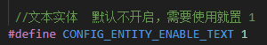

### 步骤2.创建Text实体
> :warning:**前提条件:**<br>
> - 1.创建实体的前提条件是已经开启了对应的资源<br>
> - 2.必须设备上线之前创建好实体，否则设备上线后，HomeAssistant无法识别实体。<br>
- 1. 创建实体,需要通过`ha_text_entity_t`结构体来创建实体,如:
  ```c
   ha_text_entity_t text = {
                .name = "文本",
                .unique_id = "text_1",
  };
  if (text.text_value == NULL)
      text.text_value = pvPortMalloc(255);
  ```
> 其中，`name`是实体的名称，`unique_id`是实体的唯一ID，两个参数都是必须填写。<br>
> `text_value`是文本的值，如果需要使用文本的值，需要手动分配内存，否则会导致内存溢出。

- 2.  调用`homeAssistant_device_add_entity`函数，将实体添加到设备中，如：
  ```c
   ha_text_entity_t text = {
                .name = "文本",
                .unique_id = "text_1",
  };
  if (text.text_value == NULL)
      text.text_value = pvPortMalloc(255);
  homeAssistant_device_add_entity(CONFIG_HA_ENTITY_TEXT, &text);
  ````
#### Text 实体参数

|参数名称|权限<br>:red_circle:必选 :green_circle:可选|参数类型|参数说明|
|:---:|:---:|:---:|:---:|
|name|:red_circle:|char*|实体的名称|
|entity_config_topic|:green_circle:|char*|实体配置主题|
|config_data|:green_circle:|char*|实体配置数据|
|object_id|:green_circle:|char*|实体对象ID|
|unique_id|:red_circle:|char*|实体唯一ID|
|availability_mode|:green_circle:|char*|可用性模式|
|availability_template|:green_circle:|char*|可用性模板|
|availability_topic|:green_circle:|char*|可用性主题|
|payload_available|:green_circle:|char*|可用负载|
|payload_not_available|:green_circle:|char*|不可用负载|
|enabled_by_default|:green_circle:|bool|默认启用|
|encoding|:green_circle:|char*|编码|
|entity_category|:green_circle:|char*|实体类别|
|icon|:green_circle:|char*|图标|
|json_attributes_template|:green_circle:|char*|JSON属性模板|
|json_attributes_topic|:green_circle:|char*|JSON属性主题|
|max|:green_circle:|int|最大值|
|min|:green_circle:|int|最小值|
|mode|:green_circle:|char*|模式|
|pattern|:green_circle:|char*|模式|
|command_template|:green_circle:|char*|命令模板|
|command_topic|:green_circle:|char*|命令主题|
|qos|:green_circle:|int|服务质量|
|retain|:green_circle:|bool|保留|

#### icon 设置：请参考[icon章节](#icon)

### 步骤3.接收文本
HomeAssistant通过MQTT向设备发送文本时，设备端会触发`HA_EVENT_MQTT_COMMAND_TEXT_VALUE`事件，用户可以在事件回调函数中获取到文本指令，如：
```c
static void homeAssistant_event_cb(ha_event_t event, void *arg)
{
    switch (event)
    { 
      //其他事件
      case HA_EVENT_MQTT_COMMAND_TEXT_VALUE:
            HA_LOG_I("<<<<<<<<<< HA_EVENT_MQTT_COMMAND_TEXT_VALUE=%s\r\n", ha_dev->entity_text->command_text->text_value);
            break;
    default:
        break;
    }
}
```
### 步骤4.发送文本
因为Text实体是字符串，所以发送的文本都需要通过`text_value`来设置，然后再使用`homeAssistant_device_send_entity_state`函数发送,如：
```c
if (text.text_value == NULL)
      text.text_value = pvPortMalloc(255);
strcpy(text.text_value, "Hello World!");
homeAssistant_device_send_entity_state(CONFIG_HA_ENTITY_TEXT, &text,0);
```
>`text.text_value`只是一个指针，如果要发送字符串，需要先分配内存，然后使用`strcpy`函数将字符串复制到`text_value`中，最后使用`homeAssistant_device_send_entity_state`函数发送。<br>
>如果有要发送的字符串是常量字符串，则不需要分配内存，可以直接复制字符串。<br>

## Number

Number 实体,即数字实体,在HomeAssistant中可以用来表示温度、湿度、亮度等数值。在HomeAssistant中，Number实体可以接收数值指令.

### 步骤1.开启Number资源
Number 需要开启`CONFIG_ENTITY_ENABLE_NUMBER`资源，需要通过以下方式开启Number资源：
- 1. 打开[homeAssistantDevConfig.h](../HomeAssistant-C/homeAssistantDevConfig.h)
- 2. 设置`CONFIG_ENTITY_ENABLE_NUMBER`为`1`<br>
如：<br>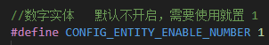

### 步骤2.创建Number实体
> :warning:**前提条件:**<br>
> - 1.创建实体的前提条件是已经开启了对应的资源<br>
> - 2.必须设备上线之前创建好实体，否则设备上线后，HomeAssistant无法识别实体。<br>

- 1. 创建实体,需要通过`ha_number_entity_t`结构体来创建实体,如:
  ```c
   ha_number_entity_t number = {
                .name = "数字",
                .unique_id = "number_1",
  };
  ```
- 2.  调用`homeAssistant_device_add_entity`函数，将实体添加到设备中，如：
  ```c
   ha_number_entity_t number = {
                .name = "数字",
                .unique_id = "number_1",
  };
  homeAssistant_device_add_entity(CONFIG_HA_ENTITY_NUMBER, &number);
  ```
  >`CONFIG_HA_ENTITY_NUMBER`是实体的类型，`&number`是实体的指针。

#### icon 设置：请参考[icon章节](#icon)

#### Number 实体配置参数
|参数名称|权限<br>:red_circle:必选 :green_circle:可选|参数类型|参数说明|
|:---:|:---:|:---:|:---:|
|name|:red_circle:|char*|实体名称|
|entity_config_topic|:green_circle:|char*|实体配置主题|
|config_data|:green_circle:|char*|配置数据|
|object_id|:green_circle:|char*|对象ID|
|unique_id|:red_circle:|char*|唯一ID|
|availability_mode|:green_circle:|char*|可用性模式|
|availability_template|:green_circle:|char*|可用性模板|
|availability_topic|:green_circle:|char*|可用性主题|
|payload_available|:green_circle:|char*|可用负载|
|payload_not_available|:green_circle:|char*|不可用负载|
|payload_reset|:green_circle:|char*|重置负载|
|enabled_by_default|:green_circle:|bool|默认启用|
|encoding|:green_circle:|char*|编码|
|entity_category|:green_circle:|char*|实体类别|
|icon|:green_circle:|char*|图标|
|json_attributes_template|:green_circle:|char*|JSON属性模板|
|json_attributes_topic|:green_circle:|char*|JSON属性主题|
|max|:green_circle:|int|最大值|
|min|:green_circle:|int|最小值|
|mode|:green_circle:|char*|模式|
|pattern|:green_circle:|char*|模式|
|command_template|:green_circle:|char*|命令模板|
|command_topic|:green_circle:|char*|命令主题|
|[device_class](#sensor-device-class-参数)|:green_circle:|ha_sensor_class_t|设备类型，和Sensor 实体一致|
|optimistic|:green_circle:|bool|乐观|
|qos|:green_circle:|int|服务质量|
|retain|:green_circle:|bool|保留|
|state_topic|:green_circle:|char*|状态主题|
|unit_of_measurement|:green_circle:|char*|单位|
|value_template|:green_circle:|char*|值模板|
|step|:green_circle:|uint8_t|步长|

### 步骤3.接收数字
和传感器只能上传功能不同，数字实体可以由HomeAssistant下发指令，并触发`HA_EVENT_MQTT_COMMAND_NUMBER_VALUE`事件，在事件回调中，可以获取到下发的数值，例如：
```c
void ha_event_cb(ha_event_t event, homeAssisatnt_device_t* ha_dev)
{
    switch (event)
    {
        //其他事件
        case HA_EVENT_MQTT_COMMAND_NUMBER_VALUE:
            HA_LOG_I("<<<<<<<<<< HA_EVENT_MQTT_COMMAND_NUMBER_VALUE=%s\r\n", ha_dev->entity_number->command_number->number_value);

            break;
        //其他事件
    }
}
```
> 因为MQTT 下发的数据都是字符串的形式，HomeAssistant在接收到数据后，会将数据转换为数字，并触发`HA_EVENT_MQTT_COMMAND_NUMBER_VALUE`事件，在事件回调中，可以获取到下发的数值。
### 步骤4.发送数字
### 整型数字

整型的数字，在发送数据时，只需要发送没有小数点的数据，可以直接使用`homeAssistant_device_send_entity_state`函数直接发送，例如：
```c
homeAssistant_device_send_entity_state(CONFIG_HA_ENTITY_NUMBER , &number, 21);
```
#### 有符号数字（包含小数点）

带小数点数字，需要先把数值装换成字符串，再给`number_value`赋值，然后再使用`homeAssistant_device_send_entity_state`函数发送，例如：
```c
char number_data[10];
sprintf(number_data, "%.2f", 21.23);
snumber.number_value =number_data;
homeAssistant_device_send_entity_state(CONFIG_HA_ENTITY_NUMBER , &number, 0);
```

## climateHVAC  

climateHVAC 实体，即空调实体，可以控制空调的开关，模式，以及设置温度，风速等。<br>

### 步骤1.开启climateHVAC资源
Number 需要开启`CONFIG_ENTITY_ENABLE_CLIMATE_HVAC`资源，需要通过以下方式开启Number资源：
- 1. 打开[homeAssistantDevConfig.h](../HomeAssistant-C/homeAssistantDevConfig.h)
- 2. 设置`CONFIG_ENTITY_ENABLE_CLIMATE_HVAC`为`1`<br>
如：<br>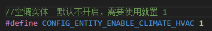

### 步骤2.创建climateHVAC实体
> :warning:**前提条件:**<br>
> - 1.创建实体的前提条件是已经开启了对应的资源<br>
> - 2.必须设备上线之前创建好实体，否则设备上线后，HomeAssistant无法识别实体。<br>

- 1. 创建实体,先需要通过`ha_climateHVAC_t`结构体来创建实体,如:
  ```c
   ha_climateHVAC_t hvac = {
                .name = "卧室空调",
                .unique_id = "hvac_1",
                .max_temp = 30,
                .min_temp = 16,
            };
  ```
  - 1. 创建支持0.5度步长的空调实体，需要设置`temp_step`为`0.5`，如：
  ```c
   ha_climateHVAC_t hvac = {
                .name = "卧室空调",
                .unique_id = "hvac_1",
                .max_temp = 30,
                .min_temp = 16,
                .temp_step = 0.5,
            };
  ```
>`name`是实体名称，`unique_id`是实体的唯一ID，`max_temp`是空调的最大温度，`min_temp`是空调的最小温度，`temp_step`是温度的步进精度。

- 2.  调用`homeAssistant_device_add_entity`函数，将实体添加到设备中，如：
  ```c
    ha_climateHVAC_t hvac = {
                .name = "卧室空调",
                .unique_id = "hvac_1",
                .max_temp = 30,
                .min_temp = 16,
            };
  homeAssistant_device_add_entity(CONFIG_HA_ENTITY_CLIMATE_HVAC, &hvac);
  ```
  >其中，`CONFIG_HA_ENTITY_CLIMATE_HVAC`是空调类型，`&hvac`是空调实体指针。

#### icon 设置：请参考[icon章节](#icon)
#### climateHVAC 配置参数
|参数名称|权限<br>:red_circle:必选 :green_circle:可选|参数类型|参数说明|
|:---:|:---:|:---:|:---:|
|action_template|:green_circle:|char*|动作模板|
|action_topic|:green_circle:|char*|动作主题|
|availability_mode|:green_circle:|char*|可用性模式|
|availability_template|:green_circle:|char*|可用性模板|
|availability_topic|:green_circle:|char*|可用性主题|
|current_humidity_template|:green_circle:|char*|当前湿度模板|
|current_humidity_topic|:green_circle:|char*|当前湿度主题|
|current_temperature_template|:green_circle:|char*|当前温度模板|
|current_temperature_topic|:green_circle:|char*|当前温度主题|
|enabled_by_default|:green_circle:|bool|是否默认启用|
|encoding|:green_circle:|char*|编码|
|entity_category|:green_circle:|char*|实体类别|
|fan_mode_command_template|:green_circle:|char*|风扇模式命令模板|
|fan_mode_command_topic|:green_circle:|char*|风扇模式命令主题|
|fan_mode_state_template|:green_circle:|char*|风扇模式状态模板|
|fan_mode_state_topic|:green_circle:|char*|风扇模式状态主题|
|fan_modes|:green_circle:|char*|风扇模式|
|fan_modes_type|:green_circle:|ac_fan_modes_trype_t|风扇模式类型|
|initial|:green_circle:|float|初始目标温度|
|icon|:green_circle:|char*|图标|
|json_attributes_template|:green_circle:|char*|JSON属性模板|
|json_attributes_topic|:green_circle:|char*|JSON属性主题|
|max_humidity|:green_circle:|float|可设置的最大湿度值|
|max_temp|:green_circle:|float|可设置的最大温度值|
|min_humidity|:green_circle:|float|可设置的最小湿度值|
|min_temp|:green_circle:|float|可设置的最小温度值|
|mode_command_template|:green_circle:|char*|模式命令模板|
|mode_command_topic|:green_circle:|char*|模式命令主题|
|mode_state_template|:green_circle:|char*|模式状态模板|
|mode_state_topic|:green_circle:|char*|模式状态主题|
|modes|:green_circle:|char*|模式|
|modes_type|:green_circle:|ac_modes_trype_t|模式类型|
|name|:red_circle:|char*|名称|
|object_id|:green_circle:|char*|对象ID|
|optimistic|:green_circle:|bool|乐观模式|
|payload_off|:green_circle:|char*|关闭指令|
|payload_on|:green_circle:|char*|打开指令|
|power_command_template|:green_circle:|char*|电源命令模板|
|power_command_topic|:green_circle:|char*|电源命令主题|
|power_state|:green_circle:|bool|电源状态|
|precision|:green_circle:|float|精度|
|preset_mode_command_template|:green_circle:|char*|预设模式命令模板|
|preset_mode_command_topic|:green_circle:|char*|预设模式命令主题|
|preset_mode_state_template|:green_circle:|char*|预设模式状态模板|
|preset_mode_state_topic|:green_circle:|char*|预设模式状态主题|
|preset_modes|:green_circle:|char*|预设模式|
|preset_modes_type|:green_circle:|ac_preset_modes_trype_t|预设模式类型|
|qos|:green_circle:|int|消息质量|
|state_class|:green_circle:|char*|状态类别|
|state_off|:green_circle:|char*|关闭状态|
|state_on|:green_circle:|char*|打开状态|
|state_topic|:green_circle:|char*|状态主题|
|sub_state_topic|:green_circle:|char*|子状态主题|
|temperature_high_command_topic|:green_circle:|char*|最高温度命令主题|
|temperature_high_state_template|:green_circle:|char*|最高温度状态模板|
|temperature_high_state_topic|:green_circle:|char*|最高温度状态主题|
|temperature_low_command_template|:green_circle:|char*|最低温度命令模板|
|temperature_low_command_topic|:green_circle:|char*|最低温度命令主题|
|temperature_low_state_template|:green_circle:|char*|最低温度状态模板|
|temperature_low_state_topic|:green_circle:|char*|最低温度状态主题|
|temperature_step|:green_circle:|float|温度步长|
|temperature_unit|:green_circle:|char*|温度单位|
|target_humidity_command_template|:green_circle:|char*|目标湿度命令模板|
|target_humidity_command_topic|:green_circle:|char*|目标湿度命令主题|
|target_humidity_state_template|:green_circle:|char*|目标湿度状态模板|
|target_humidity_state_topic|:green_circle:|char*|目标湿度状态主题|
|target_temperature_command_template|:green_circle:|char*|目标温度命令模板|
|target_temperature_command_topic|:green_circle:|char*|目标温度命令主题|
|target_temperature_state_template|:green_circle:|char*|目标温度状态模板|
|target_temperature_state_topic|:green_circle:|char*|目标温度状态主题|
|unique_id|:red_circle:|char*|唯一ID|
|unit_of_measurement|:green_circle:|char*|单位|
|value_template|:green_circle:|char*|值模板|

### 步骤3.接收空调指令
climateHVAC 有多个事件，HomeAssistant下发指令之后，都会触发对应的事件，详情请参考：[HomeAssistant MQTT 控制事件](#homeassistant-mqtt-控制事件)。
- 1. 打开或关闭空调<br>
  打开或者关闭触发的是`HA_EVENT_MQTT_COMMAND_CLIMATE_HVAC_POWER`事件，所以需要在该事件中处理打开或关闭空调的指令。如：
  ```c
    void ha_event_cb(ha_event_t event, homeAssisatnt_device_t* ha_dev)
    {
      switch (event)
      {
       //其他事件
         case HA_EVENT_MQTT_COMMAND_CLIMATE_HVAC_POWER:
           HA_LOG_I("<<<<<<<<<<  HA_EVENT_MQTT_COMMAND_CLIMATE_HVAC_POWER=%s\r\n", ha_dev->entity_climateHVAC->command_climateHVAC->power_state?"ON":"OFF");
           homeAssistant_device_send_entity_state(CONFIG_HA_ENTITY_CLIMATE_HVAC, ha_dev->entity_climateHVAC->command_climateHVAC, ha_dev->entity_climateHVAC->command_climateHVAC->power_state);
            break;
        default:
            break;
      }
    }
  ```
- 2. 设置模式
  空调的模式设置触发的是`HA_EVENT_MQTT_COMMAND_CLIMATE_HVAC_MODE`事件，所以需要在该事件中处理空调模式的指令。在HomeAssistant_MQTT-C 中，空调模式一共有6个，每个模式都有对应的类型进行表达，如下表：<br>

  |模式|类型|备注|
  |---|---|---|
  |自动|AC_MODES_AUTO||
  |制冷|AC_MODES_COOL||
  |制热|AC_MODES_HEAT||
  |除湿|AC_MODES_DRY||
  |送风|AC_MODES_FAN_ONLY||
 
  ```c
    void ha_event_cb(ha_event_t event, homeAssisatnt_device_t* ha_dev)
    {
      switch (event)
      {
       //其他事件
         case HA_EVENT_MQTT_COMMAND_CLIMATE_HVAC_MODE:
           HA_LOG_I("<<<<<<<<<<  HA_EVENT_MQTT_COMMAND_CLIMATE_HVAC_MODES=%s\r\n", ha_dev->entity_climateHVAC->command_climateHVAC->modes[ha_dev->entity_climateHVAC->command_climateHVAC->modes_type]);
            homeAssistant_device_send_entity_state(CONFIG_HA_ENTITY_CLIMATE_HVAC, ha_dev->entity_climateHVAC->command_climateHVAC, ha_dev->entity_climateHVAC->command_climateHVAC->modes_type);
            break;
        default:
            break;
      }
    }
  ```
> 推荐收到指令之后，马上回复状态，否则HomeAssistant会认为没有设置成功，会自动恢复成关闭状态

- 3. 设置温度
  空调的温度设置触发的是`HA_EVENT_MQTT_COMMAND_CLIMATE_HVAC_TEMP`事件，所以需要在该事件中处理空调温度的指令。在HomeAssistant_MQTT-C 中，空调温度的设置是支持小数点的，例如：22.0，可以直接发送出去。如：
  ```c

    void ha_event_cb(ha_event_t event, homeAssisatnt_device_t* ha_dev)
    {
      switch (event)
      {
       //其他事件
         case HA_EVENT_MQTT_COMMAND_CLIMATE_HVAC_TEMPERATURE:
           HA_LOG_I("<<<<<<<<<<  HA_EVENT_MQTT_COMMAND_CLIMATE_HVAC_TEMP=%.1f\r\n", ha_dev->entity_climateHVAC->command_climateHVAC->temperature_value);
            homeAssistant_device_send_entity_state(CONFIG_HA_ENTITY_CLIMATE_HVAC, ha_dev->entity_climateHVAC->command_climateHVAC, 0);
            break;
        default:
            break;
      }
    }
  ```
- 4. 设置风速
  风速设置只有`自动`、`低`、`中`、`高`4种，所以类型为枚举类型，在`fan_modes_type`参数体现,其对应表格如下：

  |风速|类型|fan_modes_type 值|
  |:---:|:---:|:---:|
  |自动|AC_FAN_MODES_AUTO|0|
  |低|AC_FAN_MODES_LOW|1|
  |中|AC_FAN_MODES_MEDIUM|2|
  |高|AC_FAN_MODES_HIGH|3|

  当HomeAssistant下发控制之后，会触发`HA_EVENT_MQTT_COMMAND_CLIMATE_HVAC_FAN_MODES`事件，只需要在该事件中处理执行动作即可，如：<br>
  ```c
    void ha_event_cb(ha_event_t event, homeAssisatnt_device_t* ha_dev)
    {
      switch (event)
      {
       //其他事件
         case HA_EVENT_MQTT_COMMAND_CLIMATE_HVAC_FAN_MODES:
           HA_LOG_I("<<<<<<<<<<  HA_EVENT_MQTT_COMMAND_CLIMATE_HVAC_FAN_MODE=%s\r\n", ha_dev->entity_climateHVAC->command_climateHVAC->fan_modes[ha_dev->entity_climateHVAC->command_climateHVAC->fan_modes_type]);
            homeAssistant_device_send_entity_state(CONFIG_HA_ENTITY_CLIMATE_HVAC, ha_dev->entity_climateHVAC->command_climateHVAC, ha_dev->entity_climateHVAC->command_climateHVAC->fan_modes_type);
            break;
        default:
            break;
      }
    }
  ```

### 步骤4.发送状态
- 发送模式<br>
  发送模式只需要使用`homeAssistant_device_send_entity_state`函数发送 `modes_type`参数即可，如：

  ```c
   hvac.modes_type=AC_HVAC_MODE_COOL;
   homeAssistant_device_send_entity_state(CONFIG_HA_ENTITY_CLIMATE_HVAC, &hvac, hvac.modes_type);
  ```

- 发送温度<br>
  因为温度有小数点，所以需要提前给`temperature_value`赋值，然后使用`homeAssistant_device_send_entity_state`函数发送，如：
  ```c
   hvac.temperature_value=22.0;
   homeAssistant_device_send_entity_state(CONFIG_HA_ENTITY_CLIMATE_HVAC, &hvac,1);
  ```
- 发送风速<br>
  发送风速，只需要使用`homeAssistant_device_send_entity_state`函数发送 `fan_modes_type`参数即可，如：
  ```c
   hvac.fan_modes_type=AC_FAN_MODES_AUTO;
   homeAssistant_device_send_entity_state(CONFIG_HA_ENTITY_CLIMATE_HVAC, &hvac, hvac.fan_modes_type);
  ```
## Select

Select 实体是一个下拉选择框，可以用于选择不同的选项，可以用来做模式设置、场景配置等功能。
### 步骤1.开启Select资源
Select 需要开启`CONFIG_ENTITY_ENABLE_SELECT`资源，需要通过以下方式开启Select资源：
- 1. 打开[homeAssistantDevConfig.h](../HomeAssistant-C/homeAssistantDevConfig.h)
- 2. 设置`CONFIG_ENTITY_ENABLE_SELECT`为`1`<br>
如：<br>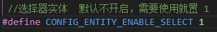

### 步骤2.创建Select实体
> :warning:**前提条件:**<br>
> - 1.创建实体的前提条件是已经开启了对应的资源<br>
> - 2.必须设备上线之前创建好实体，否则设备上线后，HomeAssistant无法识别实体。<br>

- 1. 创建Select实体,需要先创建ha_select_t结构体，创建时的注意要点：
  - `options`参数用来存储选项，因为它是个指针，所以必须指向一个地址，避免程序错误，
  - `options_numble`用来存储选项数量，
  - `enabled_by_default`用来设置是开启默认选项，<br>
  如：
  ```c
    static char* options[3] = { "1","2","3" }; 
     ha_select_t select = {
                .name = "select",
                .unique_id = "select_1",
                .options = options,
                .options_numble = 3,
                .enabled_by_default = true,
            };
  ```
- 2. 添加实体，需要使用`homeAssistant_device_add_entity`函数，如：
  ```c
    static char* options[3] = { "1","2","3" };
             ha_select_t select = {
                .name = "select",
                .unique_id = "select_1",
                .options = options,
                .options_numble = 3,
                .enabled_by_default = true,
            };
    homeAssistant_device_add_entity(CONFIG_HA_ENTITY_SELECT, &select);
  ```
#### icon 设置：请参考[icon章节](#icon)
#### Select实体参数

|参数名称|权限<br>:red_circle:必选 :green_circle:可选|参数类型|参数说明|
|:---:|:---:|:---:|:---:|
|availability_topic|:green_circle:|char*|设备可用性主题|
|availability_mode|:green_circle:|char*|设备可用性模式|
|availability_template|:green_circle:|char*|设备可用性模板|
|command_template|:green_circle:|char*|接收文本的格式|
|command_topic|:green_circle:|char*|接收文本的主题|
|enabled_by_default|:red_circle:|bool|是否开启默认选项|
|encoding|:green_circle:|char*|编码|
|entity_category|:green_circle:|char*|实体类别|
|icon|:green_circle:|char*|图标|
|json_attributes_template|:green_circle:|char*|JSON属性模板|
|json_attributes_topic|:green_circle:|char*|JSON属性主题|
|name|:red_circle:|char*|名称|
|object_id|:green_circle:|char*|对象ID|
|optimistic|:green_circle:|bool|乐观|
|platform|:green_circle:|char*|平台|
|options|:red_circle:|char**|选项|
|options_numble|:red_circle:|int|选项数量|
|qos|:green_circle:|int|服务质量|
|retain|:green_circle:|bool|保留|
|state_topic|:green_circle:|char*|状态主题|
|unique_id|:red_circle:|char*|唯一ID|
|value_template|:green_circle:|char*|值模板|

### 步骤3.接收信息
HomeAssistant 选择新的选项后，会通过MQTT发送消息，并触发`HA_EVENT_MQTT_COMMAND_SELECT_VALUE`事件，可以在事件回调函数中获取到新的选项值，新的值会储存在`command_select`结构体当中，利用`option`（选项下表）参数可以获取选择的选项，如：
  ```c
  void ha_event_cb(ha_event_t event, homeAssisatnt_device_t* ha_dev)
    {
      switch (event)
      {
       //其他事件
          case HA_EVENT_MQTT_COMMAND_SELECT_VALUE:
            HA_LOG_I("<<<<<<<<<<  HA_EVENT_MQTT_COMMAND_SELECT_VALUE %s\r\n", ha_dev->entity_select->command_select->options[ha_dev->entity_select->command_select->option]);
            break;
        default:
            break;
      }
    }
  ```
### 步骤4.发送信息
发送当前选项，只需要发送选项的下标`option`即可，不需要`Select`值。如：

  ```c
      void ha_event_cb(ha_event_t event, homeAssisatnt_device_t* ha_dev)
    {
      switch (event)
      {
       //其他事件
          case HA_EVENT_MQTT_COMMAND_SELECT_VALUE:
            HA_LOG_I("<<<<<<<<<<  HA_EVENT_MQTT_COMMAND_SELECT_VALUE %s\r\n", ha_dev->entity_select->command_select->options[ha_dev->entity_select->command_select->option]);
            homeAssistant_device_send_entity_state(CONFIG_HA_ENTITY_SELECT, ha_dev->entity_select->command_select, ha_dev->entity_select->command_select->option);
            break;
        default:
            break;
      }
    }
  ```
## Button

Button 实体是一个按钮，可以用于触发一些点击动作，比如用于开启某个功能，重置信息等。
### 步骤1.开启Button资源
Button 需要开启`CONFIG_ENTITY_ENABLE_BUTTONT`资源，需要通过以下方式开启Button资源：
- 1. 打开[homeAssistantDevConfig.h](../HomeAssistant-C/homeAssistantDevConfig.h)
- 2. 设置`CONFIG_ENTITY_ENABLE_BUTTON`为`1`<br>
如：<br>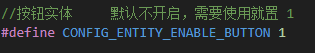

### 步骤2.创建Button实体
> :warning:**前提条件:**<br>
> - 1.创建实体的前提条件是已经开启了对应的资源<br>
> - 2.必须设备上线之前创建好实体，否则设备上线后，HomeAssistant无法识别实体。<br>

- 1.  创建Button实体,需要先创建ha_btn_entity_t结构体.
  ```c
   ha_btn_entity_t btn = {
                .name = "btn",
                .unique_id = "btn_1",
            };
  ```
- 2. 利用`homeAssistant_device_add_entity`将实体添加到设备中,如：
  ```c
     ha_btn_entity_t btn = {
                .name = "btn",
                .unique_id = "btn_1",
            };
         
    homeAssistant_device_add_entity(CONFIG_HA_ENTITY_BUTTON, &btn);
  ```
#### icon 设置：请参考[icon章节](#icon)
#### Button实体参数

|参数名称|权限<br>:red_circle:必选 :green_circle:可选|参数类型|参数说明|
|:---:|:---:|:---:|:---:|
|name|:red_circle:|char*|实体名称 必须要赋值|
|entity_config_topic|:green_circle:|char*|实体自动发现需要的topic，已经自动赋值，可以不配置|
|object_id|:green_circle:|char*|实体 工程id 可以为NULL|
|availability_mode|:green_circle:|char*|实体上下线的模式 可以为NULL|
|availability_template|:green_circle:|char*|实体上下线的数据格式，建议为NULL，采用默认|
|availability_topic|:green_circle:|char*|实体上下线上报的Topic,建议保持默认|
|command_topic|:green_circle:|char*|命令接收的Topic,需要订阅|
|command_template|:green_circle:|char*|数据格式 |
|device_class|:green_circle:|char*|设备类型，可以留空|
|enabled_by_default|:green_circle:|bool|默认LED的状态|
|encoding|:green_circle:|char*|编码方式|
|entity_category|:green_circle:|char*|实体属性，保持NULL|
|icon|:green_circle:|char*|图标|
|json_attributes_template|:green_circle:|char*|json 数据模板'|
|json_attributes_topic|:green_circle:|char*|json 数据上报Topic|
|optimistic|:green_circle:|bool|记忆模式|
|payload_available|:green_circle:|char*|在线消息内容 默认"online"|
|payload_not_available|:green_circle:|char*|离线消息内容 默认"offline"|
|payload_press|:green_circle:|char*|点击事件|
|qos|:green_circle:|int|消息服务质量|
|retain|:green_circle:|bool|是否保留该信息|
|unique_id|:red_circle:|char*|唯一的识别码，这个必须配置|
#### Button实体类型
Button 预设只有三种类型，它们的设置方法如下：
|类型|设置方法|类型说明|
|:---:|:---:|:---:|
|identify|`.device_class="identify"`|用于设备识别|
|restart|`.device_class="restart"`|用于设备重启|
|update|`.device_class="update"`|用于设备升级|

### 步骤3.接收Button信息
按钮实体只有接收功能。在HomeAssistant 按下按钮后，会下发MQTT消息，并触发`HA_EVENT_MQTT_COMMAND_BUTTON`事件，用户可以在事件回调中处理按钮事件。如：
```c
 void ha_event_cb(ha_event_t event, homeAssisatnt_device_t* ha_dev)
    {
      switch (event)
      {
       //其他事件
         case HA_EVENT_MQTT_COMMAND_BUTTON:
            HA_LOG_I("<<<<<<<<<<  HA_EVENT_MQTT_COMMAND_BUTTON is Press\r\n");
            break;
        default:
            break;
      }
    }

```
## Device Trigger

Device Trigger 是一个设备触发器，可以用于触发一些动作，比如按键的按下、松开、长按等。通常会配合HomeAssistant的自动化脚本来使用。

### 步骤1.开启Device Trigger资源
Device Trigger 需要开启`CONFIG_ENTITY_ENABLE_DEVICE_TRIGGER`资源，需要通过以下方式开启Device Trigger资源：
- 1. 打开[homeAssistantDevConfig.h](../HomeAssistant-C/homeAssistantDevConfig.h)
- 2. 设置`CONFIG_ENTITY_ENABLE_DEVICE_TRIGGER`为`1`<br>
如：<br>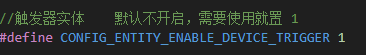

### 步骤2.创建Device Trigger实体
> :warning:**前提条件:**<br>
> - 1.创建实体的前提条件是已经开启了对应的资源<br>
> - 2.必须设备上线之前创建好实体，否则设备上线后，HomeAssistant无法识别实体。<br>

- 1.  创建Device Trigger实体,需要先创建ha_devTrig_entity_t结构体.如：<br>
  ```c
     ha_devTrig_entity_t trig_entity = {
                .type = BUTTON_SHORT_RELEASE,
                .subtype = "botton_1"
            };
  ```
- 2. 利用`homeAssistant_device_add_entity`将实体添加到设备中,如：<br>
  ```c
     ha_devTrig_entity_t trig_entity = {
                .type = BUTTON_SHORT_RELEASE,
                .subtype = "botton_1"
            };
    homeAssistant_device_add_entity(CONFIG_HA_ENTITY_DEVICE_TRIGGER, &trig_entity);
  ```
> 上面例子中，参数只配置了两个，没有`name`和`unique_id`。因为Device Trigger不是真正意义上的实体，不需要这两个参数，只需要`type`和`subtype`即可。<br>
> `type`表示触发类型，`subtype`表示触发子类型，这两个参数是必须的。<br>

#### Device Trigger实体参数

|参数名称|权限<br>:red_circle:必选 :green_circle:可选|参数类型|参数说明|
|:---:|:---:|:---:|:---:|
|type|:red_circle:|char*|触发类型|
|subtype|:red_circle:|char*|触发子类型（可认为是设备名称）|

- type 的前端自动识别，目前支持以下类型：

|类型|类型名称|类型功能|
|:---:|:---:|:---:|
|BUTTON_SHORT_PREES|按键按下|发送按下事件|
|BUTTON_SHORT_RELEASE|按键松开|发送松开事件|
|BUTTON_LONG_PRESS|长按|发送长按事件|
|BUTTON_LONG_RELEASE|长按松开|发送长按松开事件|
|BUTTON_DOUBLE_PRESS|双击|发送双击事件|
|BUTTON_TRIPLE_PRESS|三击|发送三击事件|
|BUTTON_QUADRUPLE_PRESS|四击|发送四击事件|
|BUTTON_QUINTUPLE_PRESS|五击|发送五击事件|

- subtype 的前端自动识别，目前支持以下类型：

|类型|类型名称|类型功能|
|:---:|:---:|:---:|
|turn_on|打开开关|前端识别成"打开"|
|turn_off|关闭开关|前端识别成"关闭"|
|button_1|按钮1|前端识别成"第一个按钮"|
|button_2|按钮2|前端识别成"第二个按钮"|
|button_3|按钮3|前端识别成"第三个按钮"|
|button_4|按钮4|前端识别成"第四个按钮"|
|button_5|按钮5|前端识别成"第五个按钮"|
|button_6|按钮6|前端识别成"第六个按钮"|

### 步骤3.发送devTig触发信息

Device Trigger 只有发送功能，只支持设备向HomeAssistant发送消息，不支持HomeAssistant向设备发送消息。设备会通过响应的实体信息向HomeAssistant相应的`type`。只需要使用`homeAssistant_device_send_entity_state`函数发送即可。如：
```c
 ha_devTrig_entity_t trig_entity = {
                .type = BUTTON_SHORT_RELEASE,
                .subtype = "botton_1"
            };
homeAssistant_device_add_entity(CONFIG_HA_ENTITY_DEVICE_TRIGGER, &trig_entity);
.... //其他代码
homeAssistant_device_send_entity_state(CONFIG_HA_ENTITY_DEVICE_TRIGGER, &trig_entity, 0);
```
## Scene

Scene 场景实体，你可以用来做智能家居场景配置。例如：回家模式、离家模式、睡眠模式、娱乐模式等。
> **注意：** 一个场景等于一个实体，当你有多个场景的时候，就需要创建多个场景实体，每个场景实体都需要一个唯一的`unique_id`。如果你需要一个实体多个场景选择的话，[Select](#select)实体会更好。

### 步骤1.开启Scene资源

Scene 需要开启`CONFIG_ENTITY_ENABLE_SCENE`资源，需要通过以下方式开启SCENE资源：
- 1. 打开[homeAssistantDevConfig.h](../HomeAssistant-C/homeAssistantDevConfig.h)
- 2. 设置`CONFIG_ENTITY_ENABLE_SCENE`为`1`<br>
如：<br>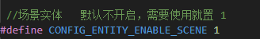


### 步骤2.创建Scene实体
> :warning:**前提条件:**<br>
> - 1.创建实体的前提条件是已经开启了对应的资源<br>
> - 2.必须设备上线之前创建好实体，否则设备上线后，HomeAssistant无法识别实体。<br>

- 1.  创建Scene实体,需要先创建ha_scene_entity_t结构体.如：<br>
  ```c
     ha_scene_entity_t trig_entity = {
               .name = "回家模式",
              .unique_id = "scene_01",
            };
  ```

- 2. 利用`homeAssistant_device_add_entity`将实体添加到设备中,如：<br>
  ```c
      ha_scene_entity_t scene_entity = {
               .name = "回家模式",
              .unique_id = "scene_01",
            };
    homeAssistant_device_add_entity(CONFIG_HA_ENTITY_SCENE, &scene_entity);
  ```
#### icon 设置：请参考[icon章节](#icon)
#### Scene 可配置参数
 
|参数名称|权限<br>:red_circle:必选 :green_circle:可选|参数类型|参数说明|
|:---:|:---:|:---:|:---:|
|availability_topic|:green_circle:|char*|设备可用性主题|
|availability_mode|:green_circle:|char*|设备可用性模式|
|availability_template|:green_circle:|char*|设备可用性模板|
|command_topic|:green_circle:|char*|命令主题|
|enabled_by_default|:green_circle:|bool|是否默认启用|
|entity_category|:green_circle:|char*|实体类别|
|entity_picture|:green_circle:|char*|实体图片的URL|
|encoding|:green_circle:|char*|编码|
|[icon](#icon)|:green_circle:|char*|图标|
|json_attributes_template|:green_circle:|char*|JSON属性模板|
|json_attributes_topic|:green_circle:|char*|JSON属性主题|
|name|:red_circle:|char*|名称|
|object_id|:green_circle:|char*|对象ID|
|payload_available|:green_circle:|char*|可用负载|
|payload_not_available|:green_circle:|char*|不可用负载|
|payload_on|:green_circle:|char*|开启负载|
|platform|:green_circle:|char*|平台|
|qos|:green_circle:|int|质量服务|
|retain|:green_circle:|char*|保留|
|unique_id|:red_circle:|char*|唯一ID|
|entity_config_topic|:green_circle:|char*|实体配置主题|

### 步骤3.接收Scene信息

HomeAssistant 下发场景激活的命令之后，设备端会触发`HA_EVENT_MQTT_COMMAND_SCENE_VALUE`事件，你可以在事件回调函数中加入`HA_EVENT_MQTT_COMMAND_SCENE_VALUE`事件的处理逻辑，并且可以使用 `scene_state` 来识别该场景是否被激活如：
```c
static void ha_event_cb(ha_event_t event, homeAssisatnt_device_t* ha_dev)
{
    switch (event)
    {
      //其他事件
      case HA_EVENT_MQTT_COMMAND_SCENE_VALUE:
          printf("HA_EVENT_MQTT_COMMAND_SCENE_VALUE\n");
          HA_LOG_I("<<<<<<<<<<  HA_EVENT_MQTT_COMMAND_SCENE_VALUE\r\n");
          //接收被激活的场景
          ha_scene_entity_t* scene_entity = (ha_scene_entity_t*)ha_dev->entity_scene->command_scene;
            //判断场景
            if (strcmp(scene_entity->unique_id, "scene_01") == 0) {
                HA_LOG_D("%s is %s\r\n", scene_entity->name, scene_entity->scene_state?"on":"off");
            }
          break;
    default:
        break;
    }
}
```
## icon

icon 即图标，每个实体你都可以自定义icon,让实体看起来更加美观。而你只需要在实体配置中添加`icon`字段即可,名称前缀为 mdi:，即 mdi:home。 例如：
```c
 ha_sensor_entity_t sensor = {
                .name = "温度",
                .unique_id = "sensor_1",
                .icon = "mdi:thermometer",
            };
```
示例样式：<br>


### 更多图标名称，请参考[mdi](https://pictogrammers.com/library/mdi/)。<br>

