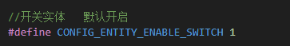
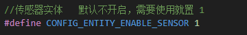
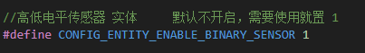

<div style="text-align: center;">

# Entity User-Manuals 实体使用指南

</div>

## 前言
### 实体添加函数
实体的添加，固定使用同一个函数,并使用`entity_type`区分：
```c
void homeAssistant_device_add_entity(char* entity_type, void* ha_entity_list)
```
>参数说明：`entity_type`为实体类型，`ha_entity_list`为实体信息结构体指针。


### 发送信息函数
HomeAssistant_MQTT-C 中，发送信息使用同一个函数，并使用`entity_type`区分：
```c
int homeAssistant_device_send_entity_state(char* entity_type, void* ha_entity_list, unsigned short state);
```
>参数说明：`entity_type`为实体类型，`ha_entity_list`为实体信息结构体指针，`state`为状态值。

### entity_type 实体类型：

| 实体类型 | 说明 | 是否已支持|
| :----: | :----: |:----: |
| CONFIG_HA_ENTITY_ALARM_CONTROL_PANEL | 报警控制面板 实体 |:x:
| CONFIG_HA_ENTITY_BINARY_SENSOR | 高低电平传感器 实体 |:white_check_mark:|
| CONFIG_HA_ENTITY_BUTTON | 按钮实体 |:white_check_mark:|
| CONFIG_HA_ENTITY_CAMERA | 摄像头实体 |:x:
| CONFIG_HA_ENTITY_COVER | 门类实体，窗帘、车门等 |:x:
| CONFIG_HA_ENTITY_DEVICE_TRACKER | 跟踪器实体，GPS定位等 |:x:
| CONFIG_HA_ENTITY_DEVICE_TRIGGER | 触发器实体 |:x:
| CONFIG_HA_ENTITY_EVENT | 事件实体 |:x:
| CONFIG_HA_ENTITY_FAN | 风扇实体 |:x:
| CONFIG_HA_ENTITY_HUMIDIFIER | 加湿器实体 |:x:
| CONFIG_HA_ENTITY_IMAGE | 图片实体 |:x:
| CONFIG_HA_ENTITY_CLIMATE_HVAC | 空调实体 |:white_check_mark:|
| CONFIG_HA_ENTITY_LAWN_MOWER | 割草机实体 |:x:
| CONFIG_HA_ENTITY_LIGHT | 灯实体 |:white_check_mark:|
| CONFIG_HA_ENTITY_LOCK | 门锁实体 |:x:
| CONFIG_HA_ENTITY_NUMBER | 数字实体 |:white_check_mark:|
| CONFIG_HA_ENTITY_SCENE | 场景实体 |:x:
| CONFIG_HA_ENTITY_SELECT | 选择器实体 |:white_check_mark:|
| CONFIG_HA_ENTITY_SENSOR | 传感器实体 |:white_check_mark:|
| CONFIG_HA_ENTITY_SIREN | 警报器实体 |:x:
| CONFIG_HA_ENTITY_SWITCH | 开关实体 |:white_check_mark:|
| CONFIG_HA_ENTITY_UPDATE | 更新实体 |:x:
| CONFIG_HA_ENTITY_TAG_SCANNER | 标签扫描仪实体 |:x:
| CONFIG_HA_ENTITY_TEXT | 文本实体 |:white_check_mark:|
| CONFIG_HA_ENTITY_VACUUM | 真空吸尘器实体 |:x:
| CONFIG_HA_ENTITY_VALVE | 阀门实体 |:x:
| CONFIG_HA_ENTITY_WATER_HEATER | 热水器实体 |:x:
### HomeAssistant MQTT 控制事件
HomeAssistant MQTT 控制事件用于接收来自HomeAssistant的控制指令，例如开关、按钮、数字等实体的控制指令。每种事件需要开启对应的实体资源才可以使用。事件列表如下：
| 事件类型 | 权限 |说明 |
| :----: | :----: |:----: |
| HA_EVENT_NONE | / |无事件 |
| HA_EVENT_MQTT_CONNECED | / |服务器连接成功事件 |
| HA_EVENT_MQTT_DISCONNECT | / |服务器断开事件 |
| HA_EVENT_HOMEASSISTANT_STATUS_ONLINE | / |HomeAssisstant 在线事件 |
| HA_EVENT_HOMEASSISTANT_STATUS_OFFLINE | / |HomeAssistant 掉线事件 |
| HA_EVENT_MQTT_COMMAND_SWITCH | 需开启Switch资源 |服务器下发开关命令事件，当在HA操作开关时，会触发这个事件 |
| HA_EVENT_MQTT_COMMAND_LIGHT_SWITCH | 需开启light资源 |light 灯的开关事件 |
| HA_EVENT_MQTT_COMMAND_LIGHT_RGB_UPDATE | 需开启light资源 |light 灯的RGB 颜色下发事件 |
| HA_EVENT_MQTT_COMMAND_LIGHT_BRIGHTNESS | 需开启light资源 |light 灯的亮度数据下发事件 |
| HA_EVENT_MQTT_COMMAND_TEXT_VALUE | 需开启Text资源  |服务器下发text内容事件 |
| HA_EVENT_MQTT_COMMAND_CLIMATE_HVAC_POWER | 需开启climateHVAC资源  |服务器下发的空调开关事件 |
| HA_EVENT_MQTT_COMMAND_CLIMATE_HVAC_MODES | 需开启climateHVAC资源 |设置模式 |
| HA_EVENT_MQTT_COMMAND_CLIMATE_HVAC_TEMP | 需开启climateHVAC资源 |设置温度 |
| HA_EVENT_MQTT_COMMAND_CLIMATE_HVAC_FAN_MODES | 需开启climateHVAC资源 |设置风力 |
| HA_EVENT_MQTT_COMMAND_SELECT_VALUE | 需开启select资源 |服务器下发select内容事件 |
| HA_EVENT_MQTT_COMMAND_BUTTON | 需开启button资源 |服务器下发button内容事件 |
| HA_EVENT_MQTT_ERROR | / |服务器错误事件 |

## Switch 

Switch 实体是HomeAssistant中的一种设备类型，用于表示可以打开或关闭的设备，例如灯泡、插座等。
### 步骤1.开启资源

任何实体，在使用之前都需要开启对应的资源，Switch资源,在HomeAssistant_MQTT-C 中，需要通过以下方式开启Switch资源：
- 1. 打开[homeAssistantDevConfig.h](../HomeAssistant-C/homeAssistantDevConfig.h)
- 2. 设置`CONFIG_ENTITY_ENABLE_SWITCH`为`1`<br>
如：<br>

### 步骤2.创建实体

> :warning:**前提条件:**<br>
> - 1.创建实体的前提条件是已经开启了对应的资源，例如Switch实体，需要开启Switch资源。<br>
> - 2.必须设备上线之前创建好实体，否则设备上线后，HomeAssistant无法识别实体。

Switch实体，在HomeAssistant_MQTT-C 中，需要通过以下方式创建实体：
- 1. 创建 Switch 实体信息结构体，并初始化。必填参数有`name`、`unique_id`，其他参数可选。<br>
```c
static ha_sw_entity_t sw = {
                .name = "开关",
                .unique_id = "sw_1",
                .icon = "mdi:power",//图标：可选
            };
```
- 2. 调用`homeAssistant_device_add_entity`函数，将实体添加到设备中，如：
```c
static ha_sw_entity_t sw = {
                .name = "开关",
                .unique_id = "sw_1",
               .icon = "mdi:power",
            };
homeAssistant_device_add_entity(CONFIG_HA_ENTITY_SWITCH, &sw);
```
>其中，`CONFIG_HA_ENTITY_SWITCH`为实体类型，`&sw`为实体信息结构体指针。

#### Switch 实体参数

|参数名|权限<br>:red_circle:必选 :green_circle:可选|类型|描述|
|:----:|:----:|:----:|:----:|
|name|:red_circle:|char*|实体名称|
|entity_config_topic|:green_circle:|char*|实体自动发现需要的topic，已经自动赋值，可以不配置|
|object_id|:green_circle:|char*|实体 工程id 可以为NULL|
|availability_mode|:green_circle:|char*|实体上下线的模式 可以为NULL|
|availability_template|:green_circle:|char*|实体上下线的数据格式，建议为NULL，采用默认|
|availability_topic|:green_circle:|char*|实体上下线上报的Topic,建议保持默认|
|command_topic|:green_circle:|char*|命令接收的Topic,需要订阅|
|state_topic|:green_circle:|char*|上报给HA的数据的Topic，默认已配置|
|device_class|:green_circle:|char*|设备类型，可以留空|
|enabled_by_default|:green_circle:|bool|默认LED的状态|
|encoding|:green_circle:|char*|编码方式|
|entity_category|:green_circle:|char*|实体属性，保持NULL|
|icon|:green_circle:|char*|图标|
|json_attributes_template|:green_circle:|char*|json 数据模板|
|optimistic|:green_circle:|char*|记忆模式|
|payload_available|:green_circle:|char*|在线消息内容 默认"online"|
|payload_not_available|:green_circle:|char*|离线消息内容 默认"offline"|
|payload_off|:green_circle:|char*|开关状态内容，默认"ON"|
|payload_on|:green_circle:|char*|开关状态内容，默认"OFF"|
|qos|:green_circle:|int|消息服务质量|
|retain|:green_circle:|bool|是否保留该信息|
|state_off|:green_circle:|char*|状态 关|
|state_on|:green_circle:|char*|状态 开|
|unique_id|:red_circle:|char*|唯一的识别码，这个必须配置|
|value_template|:green_circle:|char*|数据格式|

#### icon 设置：请参考[icon章节](#icon)
#### device_class 参数

Device Class 是HomeAssistant中的预设的参数，用于描述设备的功能，例如开关、温度传感器等。Device Class 可以帮助HomeAssistant更好地理解设备的功能，并为其提供相应的配置和操作，例如自动分配`icon`。<br>
而Switch 实体的预设Device Class 参数只有三个，分别为：

- none:通用开关。 这是默认设置，无需设置,如果设置了这个参数，会导致实体无法显示。
- outlet:电源插座。
- switch:通用开关。<br>

它们三个对应在HomeAssistant的样式：

|名称|配置方法|样式|功能|
|:----:|:----:|:----:|:----:|
|outlet|.device_class="outlet"||电源插座|
|switch|.device_class="switch"||通用开关|

### 步骤3.发送开关状态
HomeAssistant_MQTT-C 中，Switch实体的状态，通过`homeAssistant_device_entity_update`函数发送，如：
```c
  homeAssistant_device_send_entity_state(CONFIG_HA_ENTITY_SWITCH, &sw, 1);
```
### 步骤3.接收控制指令
HomeAssistant_MQTT-C 中，Switch实体的控制指令，通过`ha_event_cb`回调函数接收，会触发`HA_EVENT_MQTT_COMMAND_SWITCH`事件，可以使用 `power_state` 判断开关指令:`0`为关，`1`为开。<br>
示例如下：
```c
void ha_event_cb(ha_event_t event, homeAssisatnt_device_t* ha_dev)
{
    switch (event)
    {
        // ... 其他事件
        case HA_EVENT_MQTT_COMMAND_SWITCH:
        {
            // 接收开关控制指令
              HA_LOG_I("<<<<<<<<<< HA_EVENT_MQTT_COMMAND_SWITCH=%s\r\n", ha_dev->entity_switch->command_switch->switch_state?"ON":"OFF");
            break;
        }
        // ... 其他事件
    }
}
```

### 步骤4.发送开关状态
HomeAssistant_MQTT-C 中，Switch实体的状态，通过`homeAssistant_device_entity_update`函数发送，如：
```c
  homeAssistant_device_send_entity_state(CONFIG_HA_ENTITY_SWITCH, &sw, 1);
```
>其中，`CONFIG_HA_ENTITY_SWITCH`为实体类型，`&sw`为实体信息结构体指针，`1`为开关状态，`1`为开，`0`为关。


## Sensor 

Sensor 实体是HomeAssistant中的一种设备类型，用于表示可以测量某种状态的设备，例如温度、湿度、光照强度等。

### 步骤1.开启资源
任何实体，在使用之前都需要开启对应的资源，Sensor资源,在HomeAssistant_MQTT-C 中，需要通过以下方式开启Sensor资源：
- 1. 打开[homeAssistantDevConfig.h](../HomeAssistant-C/homeAssistantDevConfig.h)
- 2. 设置`CONFIG_ENTITY_ENABLE_SENSOR`为`1`<br>
如：<br>

### 步骤2.创建实体
> :warning:**前提条件:**<br>
> - 1.创建实体的前提条件是已经开启了对应的资源，例如Sensor实体，需要开启Sensor资源。<br>
> - 2.必须设备上线之前创建好实体，否则设备上线后，HomeAssistant无法识别实体。

Sensor实体，在HomeAssistant_MQTT-C 中，需要通过以下方式创建实体：
- 1. 创建 Sensor 实体信息结构体，并初始化。必填参数有`name`、`unique_id`其他参数可选。<br>
  ```c
  static ha_sensor_entity_t sensor = {
                .name = "温度",
                .unique_id = "sensor_1",
            };
  ```
- 2. 调用`homeAssistant_device_add_entity`函数，将实体添加到设备中，如：
  ```c
  static ha_sensor_entity_t sensor = {
                .name = "温度",
                .unique_id = "sensor_1",
            };
  homeAssistant_device_add_entity(CONFIG_HA_ENTITY_SENSOR, &sensor);
  ```
  >其中，`CONFIG_HA_ENTITY_SENSOR`为实体类型，`&sensor`为实体信息结构体指针。

#### Sensor 实体参数
|参数名|权限<br>:red_circle:必选 :green_circle:可选|类型|描述|
|:----:|:----:|:----:|:----|
|name|:red_circle:|char*|实体名称|
|entity_config_topic|:green_circle:|char*|配置主题|
|config_data|:green_circle:|char*|配置数据|
|object_id|:green_circle:|char*|对象ID|
|unique_id|:red_circle:|char*|唯一的识别码，这个必须配置|
|availability_mode|:green_circle:|char*|可用性模式|
|availability_template|:green_circle:|char*|可用性模板|
|availability_topic|:green_circle:|char*|可用性主题|
|device_class|:green_circle:|ha_sensor_class_t|设备类|
|payload_available|:green_circle:|char*|可用负载|
|payload_not_available|:green_circle:|char*|不可用负载|
|suggested_display_precision|:green_circle:|unsigned short|建议显示精度|
|enabled_by_default|:green_circle:|bool|默认启用|
|entity_category|:green_circle:|char*|实体类别|
|icon|:green_circle:|char*|图标|
|json_attributes_template|:green_circle:|char*|JSON属性模板|
|json_attributes_topic|:green_circle:|char*|JSON属性主题|
|last_reset_value_template|:green_circle:|char*|最后重置值模板|
|qos|:green_circle:|unsigned short|服务质量|
|retain|:green_circle:|bool|保留|
|state_class|:green_circle:|char*|状态类|
|state_topic|:green_circle:|char*|状态主题|
|unit_of_measurement|:green_circle:|char*|单位|
|value_template|:green_circle:|char*|值模板|
|expire_after|:green_circle:|unsigned short|过期时间|
|force_update|:green_circle:|bool|强制更新|
|sensor_data|:green_circle:|void*|传感器数据|

#### icon 设置：请参考[icon章节](#icon)

#### device_class 参数

Sensor 实体预设的Device Clash有很多，HomeAssistant_MQTT-C 中，通过`ha_sensor_class_t`枚举类型定义，列表如下：

|类型|配置方式|描述|
|:----:|:----|:----:|
|Class_None| \\ | 通用传感器。 这是默认设置，无需设置。|
|Class_apparent_power|.device_class=Class_apparent_power|功率计，单位：VA
|Class_aqi| .device_class=Class_aqi |空气质量指数(无单位)|
|Class_area|.device_class=Class_area|面积，单位：m², cm², km², mm², in², ft², yd², mi², ac, ha|
|Class_atmospheric_pressure|.device_class=Class_atmospheric_pressure|大气压力，单位：cbar, bar, hPa, mmHg, inHg, kPa, mbar, Pa 或 psi|
|Class_battery|.device_class=Class_battery|电池电量，单位：%|
|Clase_blood_glucose_concentration|.device_class=Clase_blood_glucose_concentration|血氧浓度，单位：mg/dL,mmol/L|
|Class_carbon_dioxide|.device_class=Class_carbon_dioxide|二氧化碳浓度，单位：ppm|
|Class_carbon_monoxide|.device_class=Class_carbon_monoxide|一氧化碳浓度，单位：ppm|
|Class_current|.device_class=Class_current|电流，单位：A，mA|
|Class_data_rate|.device_class=Class_data_rate|传输速率，单位：bit/s, kbit/s, Mbit/s, Gbit/s, B/s, kB/s, MB/s, GB/s, KiB/s, MiB/s 或 GiB/s|
|Class_data_size|.device_class=Class_data_size|数据大小，单位：bit, kbit, Mbit, Gbit, B, kB, MB, GB, TB, PB, EB, ZB, YB, KiB, MiB, GiB, TiB, PiB, EiB, ZiB 或 YiB|
|Class_date|.device_class=Class_date|日期字符串（ISO 8601）|
|Class_distance|.device_class=Class_distance|距离，单位：km, m, cm, mm, mi, nmi, yd, 或 in|
|Class_duration|.device_class=Class_duration|持续时间，单位：d, h, min, s, 或 ms|
|Class_energy|.device_class=Class_energy|能耗，单位：J, kJ, MJ, GJ, mWh, Wh, kWh, MWh, GWh, TWh, cal, kcal, Mcal, 或 Gcal|
|Class_energy_storage|.device_class=Class_energy_storage|能量存储，单位：J, kJ, MJ, GJ, mWh, Wh, kWh, MWh, GWh, TWh, cal, kcal, Mcal, 或 Gcal|
|Class_ha_enum|.device_class=Class_ha_enum|一组有限的（非数字）状态|
|Class_frequency|.device_class=Class_frequency|频率，单位：Hz, kHz, MHz, 或 GHz|
|Class_gas|.device_class=Class_gas|气体容量，单位：m³, ft³ 或 CCF|
|Class_humidity|.device_class=Class_humidity|空气湿度，单位：%|
|Class_illuminance|.device_class=Class_illuminanc|光照度，单位： lx|
|Class_irradiance|.device_class=Class_irradiance|辐射，单位：W/m² 或 BTU/(h⋅ft²)|
|Class_moisture|.device_class=Class_moisture|水分占比，单位：%|
|Class_monetary|.device_class=|Class_monetary |货币（[ISO 4217](https://en.wikipedia.org/wiki/ISO_4217#Active_codes)）|
|Class_nitrogen_dioxide|.device_class=Class_nitrogen_dioxide|二氧化氮，单位：µg/m³|
|Class_nitrogen_monoxide|.device_class=Class_nitrogen_monoxide|一氧化氮，单位： µg/m³|
|Class_nitrous_oxide|.device_class=Class_nitrous_oxide|一氧化二氮，单位：µg/m³|
|Class_ozone|.device_class=Class_ozone|臭氧，单位： µg/m³|
|Class_ph|.device_class=Class_ph|PH，单位：pH|
|Class_pm1|.device_class=Class_pm1|PM1，单位：µg/m³|
|Class_pm25|.device_class=Class_pm25|PM2.5，单位：µg/m³|
|Class_pm10|.device_class=Class_pm10|PM10，单位：µg/m³|
|Class_power_factor|.device_class=Class_power_factor|功率因数（无单位），单位可以是无或 %|
|Class_power|.device_class=Class_power|功率，单位：mW, W, kW, MW, GW 或 TW|
|Class_precipitation|.device_class=Class_precipitation|降水，单位：cm, in 或 mm|
|Class_precipitation_intensity|.device_class=Class_precipitation_intensity|降水强度，单位：in/d, in/h, mm/d 或 mm/h|
|Class_pressure|.device_class=Class_pressure|压力，单位：Pa, kPa, hPa, bar, cbar, mbar, mmHg, inHg 或 psi|
|Class_reactive_power|.device_class=Class_reactive_power|无功功率，单位：var|
|Class_signal_strength|.device_class=Class_signal_strength|信号强度，单位：dB 或 dBm|
|Class_sound_pressure|.device_class=Class_sound_pressure|声压，单位：dB 或 dBm|
|Class_speed|.device_class=Class_speed|速度，单位：ft/s, in/d, in/h, in/s, km/h, kn, m/s, mph, mm/d, 或 mm/s|
|Class_sulphur_dioxide|.device_class=|二氧化硫，单位：µg/m³|
|Class_temperature|.device_class=Class_temperature|温度，单位：°C, °F 或 K|
|Class_timestamp|.device_class=Class_timestamp|时间戳(ISO 8601)|
|Class_volatile_organic_compounds|.device_class=Class_volatile_organic_compounds|挥发性有机化合物，单位：µg/m³|
|Class_volatile_organic_compounds_parts|.device_class=Class_volatile_organic_compounds_parts|挥发性有机化合物部分，单位：ppm 或 ppb|
|Class_voltage|.device_class=Class_voltage|电压，单位：V, mV, µV, kV, MV|
|Class_volume|.device_class=Class_volume|体积，单位： L, mL, gal, fl. oz., m³, ft³, 或 CCF|
|Class_volume_flow_rate|.device_class=Class_volume_flow_ra|体积流量，单位： m³/h, ft³/min, L/min, gal/min, 或 mL/s|
|Class_volume_storage|.device_class=Class_volume_storage|体积存储，单位：L, mL, gal, fl. oz., m³, ft³, 或 CCF|
|Class_water|.device_class=Class_water|水，单位：L, gal, m³, ft³, 或 CCF|
|Class_weight|.device_class=Class_weight|重量，单位：kg, g, mg, µg, oz, lb, 或 st|
|Class_wind_speed|.device_class=Class_wind_speed|风速，单位：Beaufort, ft/s, km/h, kn, m/s, 或 mph|

### 步骤3.发送传感器值

#### 整型传感器值

整型的传感器值，例如低精度的温度传感器，湿度传感器等，在发送数据时，只需要发送没有小数点的数据，可以直接使用`homeAssistant_device_send_entity_state`函数直接发送，例如：
```c
homeAssistant_device_send_entity_state(CONFIG_HA_ENTITY_SENSOR, &sensor, 21);
```

#### 有符号传感器值（包含小数点）

带小数点传感器值，例如高精度的温度传感器，在发送数据时，需要先把数值装换成字符串，再给`sensor_data`赋值，然后再使用`homeAssistant_device_send_entity_state`函数发送，例如：
```c
char sensor_data[10];
sprintf(sensor_data, "%.2f", 21.23);
sensor.sensor_data = sensor_data;
homeAssistant_device_send_entity_state(CONFIG_HA_ENTITY_SENSOR, &sensor, 0);
```

## Binary sensor
Bianry sensor 即二进制传感器，例如开关，门磁，窗磁等，二进制传感器只有开和关两种状态.

### 步骤1.开启资源
Bianry sensor 需要开启`CONFIG_ENTITY_ENABLE_BINARY_SENSOR`资源，需要通过以下方式开启Bianry sensor资源：
- 1. 打开[homeAssistantDevConfig.h](../HomeAssistant-C/homeAssistantDevConfig.h)
- 2. 设置`CONFIG_ENTITY_ENABLE_BINARY_SENSOR`为`1`<br>
如：<br>

### 步骤2.创建实体
> :warning:**前提条件:**<br>
> - 1.创建实体的前提条件是已经开启了对应的资源<br>
> - 2.必须设备上线之前创建好实体，否则设备上线后，HomeAssistant无法识别实体。

- 1. 创建实体，例如门磁开关，在创建实体时，需要设置`name`和`unique_id`两个必选参数，例如：
  ```c
  static ha_Bsensor_entity_t sensor = {
                .name = "门磁开关",
                .unique_id = "sensor_1",
            };
  ```
  > 其中,`name`为实体名称，`unique_id`为实体唯一标识，`unique_id`必须为全局唯一，不能重复。
- 2. 调用`homeAssistant_device_add_entity`函数，将实体添加到设备中，如：
  ```c
    static ha_Bsensor_entity_t sensor = {
                .name = "门磁开关",
                .unique_id = "sensor_1",

            };
    homeAssistant_device_add_entity(CONFIG_HA_ENTITY_BINARY_SENSOR, &sensor);
  ```
#### Bianry sensor 所有可配置参数
|参数名称|权限<br>:red_circle:必选 :green_circle:可选|参数类型|参数说明|
|:---:|:---:|:---:|:---:|
|name|:red_circle:|char*|实体名称|
|entity_config_topic|:green_circle:|char*|实体配置主题|
|config_data|:green_circle:|char*|实体配置数据|
|object_id|:green_circle:|char*|实体对象ID|
|unique_id|:red_circle:|char*|实体唯一标识|
|availability_mode|:green_circle:|char*|实体可用性模式|
|availability_template|:green_circle:|char*|实体可用性模板|
|availability_topic|:green_circle:|char*|实体可用性主题|
|payload_available|:green_circle:|char*|实体可用性payload|
|payload_not_available|:green_circle:|char*|实体不可用性payload|
|device_class|:green_circle:|ha_Bsensor_class_t|实体设备类型|
|entity_category|:green_circle:|char*|实体类别|
|icon|:green_circle:|char*|实体图标|
|json_attributes_template|:green_circle:|char*|实体JSON属性模板|
|json_attributes_topic|:green_circle:|char*|实体JSON属性主题|
|qos|:green_circle:|int|实体QoS|
|retain|:green_circle:|bool|实体是否保留|
|state_class|:green_circle:|char*|实体状态类别|
|state_topic|:green_circle:|char*|实体状态主题|
|value_template|:green_circle:|char*|实体值模板|
|expire_after|:green_circle:|unsigned short|实体过期时间|
|force_update|:green_circle:|bool|实体是否强制更新|
|enabled_by_default|:green_circle:|bool|实体是否默认启用|
|state|:green_circle:|bool|实体状态|
|payload_off|:green_circle:|char*|实体关闭payload|
|payload_on|:green_circle:|char*|实体打开payload|

#### device class 参数

|参数名称|配置方式|参数说明|
|:---:|:---:|:---:|
|Bclass_None| \\ | 无参数，不需要配置此选项，否则会导致无法创建实体 |
|Bclass_battery|`.device_class=Bclass_battery`|`on`表示低电平，`off`表示正常|
|Bclass_battery_charging|`.device_class=Bclass_battery_charging`|`on`表示电池低压，`off`表示正常|
|Bclass_carbon_monoxide|`.device_class=Bclass_carbon_monoxide`|`on`表示检测到一氧化碳，`off`表示未检测到|
|Bclass_cold|`.device_class=Bclass_cold`|`on`表示温度过低，`off`表示正常|
|Bclass_connectivity|`.device_class=Bclass_connectivity`|`on`表示设备在线，`off`表示设备离线|
|Bclass_door|`.device_class=Bclass_door`|`on`表示门打开，`off`表示门关闭|
|Bclass_garage_door|`.device_class=Bclass_garage_door`|`on`表示门打开，`off`表示门关闭|
|Bclass_gas|`.device_class=Bclass_gas`|`on`表示检测到燃气，`off`表示未检测到|
|Bclass_heat|`.device_class=Bclass_heat`|`on`表示温度过高，`off`表示正常|
|Bclass_light|`.device_class=Bclass_light`|`on`表示检测到光线，`off`表示未检测到|
|Bclass_lock|`.device_class=Bclass_lock`|`on`表示门锁打开，`off`表示门锁关闭|
|Bclass_moisture|`.device_class=Bclass_moisture`|`on`表示检测到湿度，`off`表示未检测到|
|Bclass_motion|`.device_class=Bclass_motion`|`on`表示检测到运动，`off`表示未检测到|
|Bclass_moving|`.device_class=Bclass_moving`|`on`表示运动中，`off`表示静止|
|Bclass_occupancy|`.device_class=Bclass_occupancy`|`on`表示有人，`off`表示无人|
|Bclass_opening|`.device_class=Bclass_opening`|`on`表示打开，`off`表示关闭|
|Bclass_plug|`.device_class=Bclass_plug`|`on`表示插上电源，`off`表示拔掉电源|
|Bclass_power|`.device_class=Bclass_power`|`on`表示有电，`off`表示没电|
|Bclass_presence|`.device_class=Bclass_presence`|`on`表示有人，`off`表示无人|
|Bclass_problem|`.device_class=Bclass_problem`|`on`表示有问题，`off`表示正常|
|Bclass_running|`.device_class=Bclass_running`|`on`表示运行中，`off`表示停止|
|Bclass_afety|`.device_class=Bclass_afety`|`on`表示安全，`off`表示不安全|
|Bclass_smoke|`.device_class=Bclass_smoke`|`on`表示检测到烟雾，`off`表示未检测到|
|Bclass_sound|`.device_class=Bclass_sound`|`on`表示检测到声音，`off`表示未检测到|
|Bclass_tamper|`.device_class=Bclass_tamper`|`on`表示被破坏，`off`表示正常|
|Bclass_update|`.device_class=Bclass_update`|`on`表示有更新，`off`表示无更新|
|Bclass_vibration|`.device_class=Bclass_vibration`|`on`表示检测到振动，`off`表示未检测到|
|Bclass_window|`.device_class=Bclass_window`|`on`表示窗打开，`off`表示窗关闭|

### 步骤3.发送传感器状态

## Light    
### 步骤1.开启资源

### 步骤2.创建实体

### 步骤3.接收控制指令

### 步骤4.发送状态

## Number

### 步骤1.开启资源

### 步骤2.创建实体

### 步骤3.接收数字

### 步骤4.发送数字

## climateHVAC  

### 步骤1.开启资源

### 步骤2.创建实体

### 步骤3.接收控制指令

### 步骤4.发送状态

## icon

icon 即图标，每个实体你都可以自定义icon,让实体看起来更加美观。而你只需要在实体配置中添加`icon`字段即可,名称前缀为 mdi:，即 mdi:home。 例如：
```c
static ha_sensor_entity_t sensor = {
                .name = "温度",
                .unique_id = "sensor_1",
                .icon = "mdi:thermometer",
            };
```
示例样式：<br>


### 更多图标名称，请参考[mdi](https://pictogrammers.com/library/mdi/)。<br>

